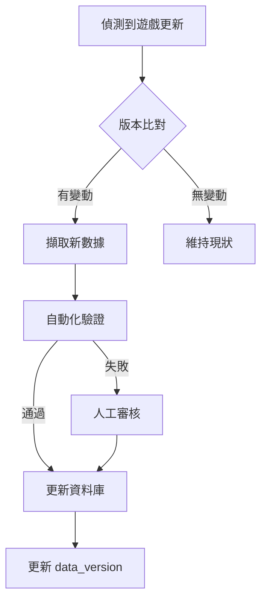

# Travian: Legends 助手系統 - 產品需求規格書 (PRD)

---

## 文件資訊

| 項目 | 內容 |
|------|------|
| **文件名稱** | Travian: Legends 助手系統 - 產品需求規格書 |
| **文件版本** | v1.1 |
| **建立日期** | 2026-01-22 |
| **最後更新** | 2026-01-22 |
| **文件狀態** | 草稿 Draft |
| **目標讀者** | 產品經理 (PM)、開發團隊、AI 編程助手 |

### 版本歷史

| 版本 | 日期 | 修改者 | 修改說明 |
|------|------|--------|----------|
| v1.0 | 2026-01-22 | - | 初版建立 |
| v1.1 | 2026-01-22 | - | 新增 PRD 格式、User Story、Ticket 拆分結構 |

### 簽核區

| 角色 | 姓名 | 簽核日期 | 狀態 |
|------|------|----------|------|
| 產品負責人 | | | ⏳ 待審 |
| 技術負責人 | | | ⏳ 待審 |
| 專案經理 | | | ⏳ 待審 |

---

## 目錄

1. [專案概述](#一專案概述)
2. [核心數據結構](#二核心數據結構)
3. [計算功能需求](#三計算功能需求)
4. [策略建議功能](#四策略建議功能)
5. [數據抓取功能](#五數據抓取功能)
6. [自動化執行功能](#六自動化執行功能)
7. [系統架構](#七系統架構)
8. [使用情境範例](#八使用情境範例)
9. [User Stories 與 Ticket 拆分](#九user-stories-與-ticket-拆分)
10. [開發優先順序](#十開發優先順序)
11. [技術選型建議](#十一技術選型建議)
12. [風險與限制](#十二風險與限制)
13. [成功指標](#十三成功指標)
14. [附錄](#十四附錄)

---

## 一、專案概述

### 1.1 專案背景

**Travian: Legends** 是一款複雜的網頁即時策略遊戲，玩家需要管理多個村莊、訓練軍隊、進行外交與戰爭。遊戲涉及大量的數值計算、資源管理和戰略決策。

**遊戲核心機制**:

- **資源系統**: 木材、磚塊、鐵礦、糧食四種資源
- **建築系統**: 約 40 種建築，最高 20 級
- **兵種系統**: 7 個種族，每種族約 10 種兵種
- **村莊擴張**: 透過文化點開拓或征服新村莊
- **聯盟系統**: 玩家組成聯盟進行協作
- **終局目標**: 建造 100 級世界奇蹟 (WW) 獲勝

### 1.2 專案目標

建立一個全方位的 Travian: Legends 遊戲輔助系統，整合完整數據庫、智能計算器、策略建議引擎與自動化執行能力，讓玩家能夠：

1. 查詢所有遊戲數據並進行各種計算
2. 獲得基於當前狀態的即時策略建議
3. 自動抓取遊戲狀態數據
4. 半自動執行遊戲操作（需人工確認）

### 1.3 目標用戶

| 用戶類型 | 描述 | 主要需求 |
|----------|------|----------|
| 新手玩家 | 剛接觸遊戲 | 學習機制、避免錯誤 |
| 活躍玩家 | 每天遊玩 2-4 小時 | 優化決策、節省時間 |
| 聯盟領導 | 管理聯盟團隊 | 協調作戰、數據分析 |

### 1.4 核心價值主張

| 用戶痛點 | 解決方案 |
|----------|----------|
| 數值計算複雜易錯 | 自動化計算器，精確結果 |
| 不知道該優先做什麼 | AI 策略建議，個性化指導 |
| 手動追蹤遊戲狀態耗時 | 自動抓取數據，即時更新 |
| 重複性操作繁瑣 | 半自動執行，提高效率 |
| 缺乏中文資源 | 完整中文化介面與教學 |

---

## 二、核心數據結構

### 2.1 建築數據 (Buildings)

所有建築 1-20 級完整數據，包含約 40+ 種建築類型。

#### 資料欄位

| 欄位 | 說明 | 範例 |
|------|------|------|
| 建築 ID/名稱 | 中英文名稱 | barracks / 兵營 |
| 等級 | 1-20 | 15 |
| 木材成本 | 升級所需木材 | 4060 |
| 磚塊成本 | 升級所需磚塊 | 2710 |
| 鐵礦成本 | 升級所需鐵礦 | 5030 |
| 糧食成本 | 升級所需糧食 | 2320 |
| 總資源成本 | 四種資源總和 | 14120 |
| 建造時間（基礎） | 本部 Lv1 時的建造時間 | 5:30:00 |
| 人口增加 | 該等級增加的人口 | 3 |
| 文明點 | 該等級提供的文明點 | 12 |
| 累計文明點 | 從 Lv1 到該等級的累計 | 150 |
| 效果數值 | 該等級的具體效果 | 訓練速度 -37% |
| 前置需求 | 需要哪些建築達到什麼等級 | 本部 Lv3, 集結點 Lv1 |
| 建築類別 | 資源/軍事/基礎設施/研發 | 軍事 |

#### 建築分類

資源類

資源田：伐木場、黏土坑、鐵礦場、農田
資源加成：鋸木廠、磚塊廠、鑄造廠、麵粉廠、麵包房
儲存：倉庫、糧倉、大倉庫、大糧倉、藏匿處

軍事類

訓練建築：兵營、馬廄、工坊、大兵營、大馬廄、大工坊
強化建築：鐵匠鋪、防具工坊
防禦建築：城牆（各族類型不同）、陷阱工坊（部分種族）
其他：集結點、英雄宅邸

基礎設施類

行政：本部、皇宮、行宮、大使館
交易：市場、貿易所
其他：市政廳、寶物庫

研發類

研究院

特殊建築

- 世界奇蹟相關建築

#### 成本計算公式

```
建築成本 = 基礎成本 × (成長係數 ^ (等級-1))
```

### 2.2 兵種數據 (Troops)

所有種族的完整兵種數據，涵蓋 7 個種族：

#### 種族列表

| 種族 | 英文 | 特色 |
|------|------|------|
| 羅馬 | Romans | 同時建造、強力部隊 |
| 高盧 | Gauls | 快速部隊、強防禦 |
| 日耳曼 | Teutons | 便宜部隊、掠奪加成 |
| 匈奴 | Huns | 強力騎兵、額外開村 |
| 埃及 | Egyptians | 經濟加成、防禦型 |
| 維京 | Vikings | 特殊機制 |
| 斯巴達 | Spartans | 強力步兵 |

> ⚠️ **備註**：Travian: Legends 的種族數量會隨遊戲版本更新。斯巴達 (Spartans) 是 2023 年後新增的種族，部分伺服器可能尚未開放所有種族。開發時需設計彈性架構以支援未來新增種族。

#### 資料欄位

| 欄位 | 說明 | 範例 |
|------|------|------|
| 種族 | 所屬種族 | teutons |
| 兵種 ID/名稱 | 中英文名稱 | axeman / 斧頭兵 |
| 類型 | 步兵/騎兵/攻城/偵查/特殊 | infantry |
| 攻擊力 | 基礎攻擊值 | 60 |
| 步兵防禦 | 對步兵的防禦值 | 30 |
| 騎兵防禦 | 對騎兵的防禦值 | 30 |
| 速度 (格/小時) | 移動速度 | 6 |
| 運載量 | 可搬運資源量 | 50 |
| 木材成本 | 訓練成本 | 55 |
| 磚塊成本 | 訓練成本 | 12 |
| 鐵礦成本 | 訓練成本 | 30 |
| 糧食成本 | 訓練成本 | 35 |
| 糧耗/小時 | 維持消耗 | 1 |
| 基礎訓練時間 | 訓練所需時間 | 0:26:40 |
| 訓練建築 | 兵營/馬廄/工坊 | barracks |
| 研發需求 | 研究院等級需求 | Lv1 |

#### 衍生計算欄位

- 攻擊力/糧耗
- 攻擊力/訓練時間
- 攻擊力/總成本
- 防禦力/糧耗
- 防禦力/訓練時間
- 防禦力/總成本
- 性價比綜合評分

### 2.3 資源田數據 (Resource Fields)

0-20 級（首都可超過 10 級）的完整數據

#### 資料欄位

| 欄位 | 說明 | 範例 |
|------|------|------|
| 資源類型 | 木材/磚塊/鐵礦/糧食 | wood |
| 等級 | 0-20+ | 10 |
| 產量/小時 | 基礎產量 | 145 |
| 升級成本 | 木/磚/鐵/糧 | 3780/4725/3780/945 |
| 升級時間 | 建造時間 | 1:30:00 |
| 人口增加 | 人口需求 | 3 |
| 文明點 | 提供的文明點 | 2 |
| 產量增加量 | 相比上一級增加多少 | 20 |
| ROI (小時) | 回本時間 | 成本÷產量增加 |
| 累計投資 | 從 Lv0 升到該等級的總成本 | 25000 |

### 2.4 綠洲數據 (Oases)

| 欄位 | 說明 | 範例 |
|------|------|------|
| 綠洲類型 | 單資源/雙資源 | 單資源 |
| 資源組合 | 木/磚/鐵/糧的組合 | 木材 50% |
| 加成百分比 | 25%/50% | 50% |
| 野獸組合 | 各類野獸數量 | 狼x5, 熊x3 |
| 野獸總戰力 | 攻擊/防禦總值 | ATK:500, DEF:800 |

### 2.5 野獸/Natar 數據

| 欄位 | 說明 | 範例 |
|------|------|------|
| 名稱 | 野獸/Natar 名稱 | 狼 (Wolf) |
| 攻擊力 | 攻擊值 | 100 |
| 步兵防禦 | 防禦值 | 80 |
| 騎兵防禦 | 防禦值 | 60 |
| 資源掉落 | 擊敗後獲得的資源 | 10-20 |
| 經驗值 | 英雄可獲得的經驗 | 20 |

### 2.6 神器數據 (Artefacts)

| 欄位 | 說明 | 範例 |
|------|------|------|
| 神器名稱 | 中英文名稱 | 訓練師的神器 |
| 類型 | 小型/大型/獨特 | 大型 |
| 效果範圍 | 村莊/帳號 | 帳號 |
| 效果描述 | 效果說明 | 訓練速度加快 |
| 效果數值 | 具體百分比或數值 | -50% 訓練時間 |
| 掉落時間 | 伺服器第幾天發布 | Day 100 |

### 2.7 英雄系統數據

| 欄位 | 說明 | 範例 |
|------|------|------|
| 等級 | 0-100 | 50 |
| 經驗值需求 | 升級所需經驗 | 5000 |
| 屬性點 | 每級獲得點數 | 4 |
| 裝備類型 | 頭盔/護甲/左手/右手/靴子/馬匹 | 頭盔 |
| 裝備效果 | 攻擊/防禦/速度加成 | +100 攻擊力 |
| 冒險獎勵表 | 各距離冒險的獎勵範圍 | 近程: 50-100 經驗 |

### 2.8 拍賣行數據

| 欄位 | 說明 | 範例 |
|------|------|------|
| 物品名稱 | 銀/金幣、資源、即時完成等 | 銀幣×1000 |
| 出現時間 | 伺服器第幾天開始出現 | Day 1 |
| 效果 | 物品效果 | 直接獲得資源 |
| 建議競標策略 | 最高出價建議 | 依市場價格 |

### 2.9 村莊類型數據

| 類型 | 資源配置 | 適合用途 |
|------|----------|----------|
| 4-4-4-6 | 平衡型 | 通用村莊 |
| 3-4-5-6 | 混合型 | 通用村莊 |
| 15c | 糧食為主 (15 農田) | 首都、部隊訓練村 |
| 9c | 糧食為主 (9 農田) | 首都、部隊訓練村 |
| 7c | 資源為主 (7 農田) | 資源村 |
| 6c | 資源為主 (6 農田) | 資源村 |

### 2.10 聯盟功能數據

- 聯盟加成效果
- 外交關係類型（NAP、同盟、戰爭）
- 聯盟戰爭機制
- 協調工具建議

### 2.11 伺服器速度數據

| 速度 | 時間換算 | 資源產量 | 部隊速度 |
|------|----------|----------|----------|
| x1 | 標準 | 標準 | 標準 |
| x2 | 0.5x | 2x | 2x |
| x3 | 0.33x | 3x | 3x |
| x5 | 0.2x | 5x | 5x |
| x10 | 0.1x | 10x | 10x |

### 2.12 慶典系統數據

| 類型 | 成本 | 文明點 | 持續時間 |
|------|------|--------|----------|
| 小慶典 | 6400木/7900磚/5300鐵/1600糧 | 500 | 24h |
| 大慶典 | 29700木/33800磚/32500鐵/6700糧 | 2000 | 24h |

### 2.13 金幣功能數據

| 功能 | 成本 | 效果 | ROI 分析 |
|------|------|------|----------|
| NPC 交易 | 3 金幣 | 資源交換 | 依比例計算 |
| 即時完成 | 變動 | 立即完成建造/訓練 | 依時間計算 |
| 25% 加成 | 變動 | Plus 帳號功能 | 長期效益 |
| 額外村莊位 | 變動 | 超過基礎限制 | 重要投資 |

---

## 三、計算功能需求

### 3.1 建築計算機

#### 功能清單

**1. 升級成本計算**

- 輸入：建築名稱、起始等級、目標等級
- 輸出：總成本（木/磚/鐵/糧）、總時間、文明點

**2. 建造時間計算**

- 輸入：本部等級、建築等級
- 輸出：實際建造時間

**3. 文明點計算**

- 輸入：特定建築組合
- 輸出：總文明點、達到開村門檻所需努力

3.2 資源田 ROI 計算機
功能清單

單田 ROI

輸入：資源類型、當前等級
輸出：升級成本、產量增加、回本時間

最佳升級順序

輸入：所有資源田當前等級
輸出：按 ROI 排序的升級建議

目標規劃

輸入：目標產量（例如：每小時 1000 木材）
輸出：所需投資、時間、建議配置

綠洲加成計算

輸入：綠洲類型、數量
輸出：實際產量加成

3.3 部隊計算機
功能清單

訓練時間計算

輸入：兵種、數量、兵營/馬廄等級
輸出：實際訓練時間

訓練成本計算

輸入：兵種、數量
輸出：總成本（木/磚/鐵/糧）

部隊維護成本

輸入：部隊組成
輸出：每小時糧食消耗

每日產量計算

輸入：建築等級、資源產量
輸出：每日可訓練數量

部隊性價比分析

輸入：兵種
輸出：攻擊力/成本、防禦力/成本等比率

3.4 戰鬥模擬器
功能清單

攻防計算

輸入：攻守雙方部隊組成
輸出：勝負、雙方損失、資源掠奪量

清野獸計算

輸入：綠洲野獸組成
輸出：需要的部隊數量、預期損失

城牆效果計算

輸入：城牆等級、防守部隊
輸出：實際防禦加成

攻城武器效果

輸入：投石車/衝撞車數量、目標建築
輸出：破壞效果

3.5 村莊規劃器
功能清單

首都規劃（15c/9c）

輸出：建築配置建議、升級順序

Hammer 村規劃

輸出：進攻村最佳建築配置

Anvil 村規劃

輸出：防守村最佳建築配置

資源村規劃

輸出：純資源產出村配置

混合村規劃

輸出：兼具多功能的村莊配置

3.6 征服計算器
功能清單

忠誠度計算

輸入：目標村莊人口、酋長/貴族數量
輸出：預期忠誠度降低、需要波數

征服成本

輸出：酋長/貴族訓練成本、總資源投入

3.7 農場效率計算器
功能清單

最佳農場半徑

輸入：部隊速度、線上時間
輸出：建議農場範圍

部隊配置

輸入：農場類型（死村/低防/中防）
輸出：最佳部隊組合

預期收益

輸入：農場清單、部隊配置
輸出：每日預期資源收益

3.8 商人效率計算器
功能清單

最佳貿易路線

輸入：資源需求、商人運載量
輸出：最佳運送方案

NPC 交易時機

輸入：資源比例、金幣成本
輸出：是否划算建議

3.9 防守協調計算器
功能清單

援軍抵達時間

輸入：援軍位置、部隊速度、目標位置
輸出：抵達時間、發兵時機

切波（Sniping）計算

輸入：敵方攻擊波時間
輸出：援軍最佳派遣時機

3.10 Fake 攻擊規劃器
功能清單

假攻擊覆蓋

輸入：目標數量、可用部隊
輸出：假攻擊派遣方案

成本效益分析

輸出：假攻擊成本與預期效果

---

## 四、策略建議功能

### 4.1 遊戲階段判斷

自動判斷玩家所處階段

| 階段 | 天數 | 特徵 | 策略重點 |
|------|------|------|----------|
| 新手保護期 | Day 1-3 | 無法被攻擊 | 快速發展、完成任務 |
| 早期發展 | Day 1-7 | 建立第二村 | 資源田優先、開村準備 |
| 中期擴張 | Day 8-30 | 多村發展 | 確立角色定位 |
| 中後期 | Day 31-100 | 軍事競爭 | 聯盟合作、神器搶奪 |
| 神器期 | Day ~100+ | 神器發布 | 搶奪/防守神器 |
| 終局/WW 期 | Day 150+ | 世界奇蹟 | 全聯盟協作建造 |

### 4.2 種族專屬策略

根據選擇的種族提供：

**1. 推薦發展路線**

- 早期建築順序
- 中期擴張策略
- 後期定位

**2. 推薦部隊配置**

- Hammer 部隊組成
- Anvil 部隊組成
- 特殊用途部隊

**3. 種族優勢利用**

- 羅馬：同時建造
- 高盧：快速支援
- 日耳曼：大量農場
- 匈奴：騎兵優勢
- 埃及：經濟發展

### 4.3 目標導向建議

根據玩家目標提供策略：

**進攻型（Hammer Builder）**

- 建築優先順序：兵營/馬廄/鐵匠鋪
- 資源分配：集中在 Hammer 村
- 部隊訓練：持續訓練進攻兵種

**防守型（Anvil Builder）**

- 建築優先順序：經濟建築/兵營
- 資源分配：多村平衡發展
- 部隊訓練：性價比高的防守兵種

**經濟型（Governor）**

- 建築優先順序：資源田/倉庫
- 資源分配：支援聯盟成員
- 部隊訓練：最低防守需求

**混合型（Hybrid）**

- 平衡配置建議
- 靈活應對策略

4.4 即時策略諮詢
玩家描述當前狀態，系統提供

下一步行動建議

應該建造什麼
應該訓練什麼
應該攻擊/防守什麼

資源使用建議

資源分配優先序
是否使用 NPC 交易

風險提醒

糧食即將不足
敵人威脅接近
關鍵時機提醒

4.5 開局模板
各種族前 72 小時最佳操作流程

精確到分鐘的建造順序
任務完成優先序
資源分配建議
部隊訓練時機

4.6 農場清單管理
記錄並管理農場

附近農場座標
上次掠奪時間
預期資源量
防守程度評估

4.7 威脅評估系統
分析週邊環境

附近玩家強度
可能的攻擊威脅
結盟/競爭建議

4.8 聯盟任務分配
團隊協作建議

神器搶奪分工
WW 攻擊協調
防守支援安排

五、數據抓取功能
5.1 Browser MCP 抓取
可抓取的數據範圍
我的村莊

座標、名稱、人口
資源現況與產量
建築清單與等級
部隊數量
建造/訓練佇列

英雄狀態

等級、經驗值、血量
屬性點配置
裝備
冒險狀態

報告

戰鬥報告（攻擊/防守結果）
偵查報告
交易報告

地圖資訊

附近村莊（玩家、人口、聯盟）
綠洲位置與野獸

聯盟資訊

成員列表
外交狀態

5.2 Map.sql 解析
伺服器整體數據

所有村莊座標、名稱、人口
所有玩家 ID、名稱、聯盟
所有聯盟資訊
局勢分析、潛在農場、競爭對手追蹤

5.3 資料抓取架構
                    ┌─────────────────┐
                    │   Travian 網頁   │
                    └────────┬────────┘
                             │ Browser MCP
                             ▼
┌─────────────────────────────────────────────┐
│              Data Scraper                    │
│  ├── village_scraper.py   (村莊數據)        │
│  ├── report_scraper.py    (報告解析)        │
│  ├── map_scraper.py       (地圖數據)        │
│  └── scheduler.py         (定時抓取)        │
└────────────────────┬────────────────────────┘
                     │
                     ▼
              ┌──────────────┐
              │   Database   │
              └──────────────┘

六、自動化執行功能
6.1 安全性原則
⚠️ 重要警告

Travian 有反作弊偵測機制
過於規律的操作會被標記
違規可能導致封禁

6.2 執行模式
模式一：半自動（推薦）
系統分析 → 產生建議 → 人工確認 → 一鍵執行

┌────────────────┐     ┌────────────────┐     ┌────────────────┐
│  策略分析引擎   │ ──▶ │   建議清單      │ ──▶ │  人工確認介面   │
└────────────────┘     └────────────────┘     └───────┬────────┘
                                                      │ 確認
                                                      ▼
                                              ┌────────────────┐
                                              │ Browser MCP    │
                                              │ 執行操作        │
                                              └────────────────┘
模式二：排程輔助

設定規則 → 時間到提醒 → 快速執行
例如：

- 「每天 8:00 提醒我派英雄冒險」
- 「兵營空閒時提醒我訓練部隊」
- 「資源滿倉前 30 分鐘提醒我」

### 6.3 可執行操作分類

| 操作類型 | 可行性 | 風險等級 | 說明 |
|----------|--------|----------|------|
| 讀取數據 | ✅ 安全 | 低 | 完全安全 |
| 自動建造 | ⚠️ 可行但有風險 | 中 | 需人工確認 |
| 自動訓練 | ⚠️ 可行但有風險 | 中 | 需人工確認 |
| 自動農場 | ❌ 高風險 | 高 | 可能被 ban |
| 自動交易 | ⚠️ 可行但有風險 | 中 | 需人工確認 |
| 自動冒險 | ⚠️ 可行但有風險 | 低-中 | 需人工確認 |

### 6.4 執行介面示例

```
=== Travian 助手建議 ===
時間：2026-01-22 14:30

📋 待執行操作：

1. [建造] 村莊A - 兵營升級 Lv12→13
   成本：4060木 / 2710磚 / 5030鐵 / 2320糧
   時間：3:46:50
   [執行] [跳過] [稍後]

2. [訓練] 村莊B - 訓練 50 斧頭兵
   成本：2750木 / 1500鐵 / 600磚 / 1750糧
   時間：2:15:00
   [執行] [跳過] [稍後]

3. [農場] 建議掠奪清單 (12 個目標)
   預期收益：~15000 資源
   [查看詳情] [一鍵派出]

4. [英雄] 冒險可出發 (最近冒險：3格)
   [派出] [跳過]
```

### 6.5 安全機制

- **人工確認**：所有操作需明確確認
- **隨機延遲**：模擬人類操作間隔
- **操作限制**：單次操作數量上限
- **異常偵測**：發現異常立即停止

七、系統架構
7.1 整體架構圖
┌─────────────────────────────────────────────────────────────────┐
│                    Travian Helper System                        │
├─────────────────────────────────────────────────────────────────┤
│                                                                 │
│  ┌──────────────┐  ┌──────────────┐  ┌──────────────┐          │
│  │   Database   │  │  Scraper     │  │  Executor    │          │
│  │              │  │              │  │              │          │
│  │ - Buildings  │  │ - Village    │  │ - Build      │          │
│  │ - Troops     │  │ - Reports    │  │ - Train      │          │
│  │ - Resources  │  │ - Map        │  │ - Trade      │          │
│  │ - Strategies │  │ - Schedule   │  │ - Adventure  │          │
│  └──────┬───────┘  └──────┬───────┘  └──────┬───────┘          │
│         │                 │                 │                   │
│         └────────────┬────┴────────────────┘                   │
│                      │                                          │
│              ┌───────▼───────┐                                  │
│              │    Engine     │                                  │
│              │               │                                  │
│              │ - Calculator  │                                  │
│              │ - Analyzer    │                                  │
│              │ - Advisor     │                                  │
│              │ - Planner     │                                  │
│              └───────┬───────┘                                  │
│                      │                                          │
│              ┌───────▼───────┐                                  │
│              │   Interface   │                                  │
│              │               │                                  │
│              │ - Claude Chat │◄──── 自然語言查詢與指令          │
│              │ - Dashboard   │                                  │
│              │ - Alerts      │                                  │
│              └───────────────┘                                  │
│                                                                 │
└─────────────────────────────────────────────────────────────────┘
7.2 資料庫結構
travian_helper_db/
├── buildings/          # 建築數據
├── troops/            # 兵種數據  
├── resources/         # 資源田數據
├── oases/             # 綠洲數據
├── artefacts/         # 神器數據
├── heroes/            # 英雄數據
├── auction/           # 拍賣行數據
├── villages/          # 村莊類型數據
├── alliances/         # 聯盟數據
├── servers/           # 伺服器速度數據
├── festivals/         # 慶典數據
├── gold_features/     # 金幣功能數據
└── strategies/        # 策略模板
7.3 主要功能模組
travian-helper/
├── database/
│   ├── buildings.json
│   ├── troops.json
│   ├── resources.json
│   └── ... (其他數據檔)
│
├── calculators/
│   ├── building_calc.py
│   ├── resource_calc.py
│   ├── troop_calc.py
│   ├── battle_sim.py
│   ├── conquest_calc.py
│   ├── farm_calc.py
│   ├── merchant_calc.py
│   ├── defense_calc.py
│   └── fake_calc.py
│
├── scrapers/
│   ├── village_scraper.py
│   ├── report_scraper.py
│   ├── map_scraper.py
│   └── scheduler.py
│
├── advisors/
│   ├── phase_advisor.py
│   ├── tribe_advisor.py
│   ├── goal_advisor.py
│   ├── template_advisor.py
│   └── threat_advisor.py
│
├── executors/
│   ├── build_executor.py
│   ├── train_executor.py
│   ├── trade_executor.py
│   └── adventure_executor.py
│
├── utils/
│   ├── formulas.py
│   ├── validators.py
│   └── helpers.py
│
└── README.md

八、使用情境範例
情境 1：新手起步
用戶：「我是日耳曼，現在 Day 5，有 2 個村，想走進攻路線，接下來該怎麼發展？」
系統回應：

判斷階段：早期發展期
種族：日耳曼
目標：進攻型
提供建議：

建築優先順序
資源分配方案
部隊訓練計畫
農場開發建議

情境 2：建築查詢
用戶：「我的兵營現在 Lv12，升到 Lv15 需要多少資源？訓練棍棒兵速度會變多快？」
系統回應：

升級成本總計
文明點獲得
訓練速度對比表

情境 3：資源規劃
用戶：「我的農田都是 Lv6，下一個該升哪塊田最划算？」
系統回應：

ROI 分析
推薦升級順序
預計回本時間

情境 4：戰鬥模擬
用戶：「我有 5000 斧頭兵和 2000 TK，打得過 50000 方陣兵的防守嗎？」
系統回應：

戰鬥結果預測
雙方損失估算
建議是否進攻

情境 5：村莊規劃
用戶：「幫我規劃一個 15c 首都的建設順序」
系統回應：

完整建築配置
升級優先順序
資源需求總計

九、資料來源與準確性
9.1 官方數據來源

Travian 官方支援站：<https://support.travian.com>
Travian Wiki (Fandom)：<https://travian.fandom.com>
Kirilloid 計算器：<http://travian.kirilloid.ru>
官方論壇與公告

9.2 數據驗證

建築成本公式交叉驗證
多來源數據比對
社群經驗確認
定期更新維護

---

## 九-B、User Stories 與 Ticket 拆分

> **本章節目的**: 為 PM 提供可直接轉換為 PRD 的 User Story 格式，以及為開發團隊/AI 提供可直接執行的 Ticket 拆分。

### 9B.1 User Story 格式說明

每個 User Story 遵循以下格式：

```
【User Story ID】US-XXX
【標題】簡短描述
【角色】作為一個 [角色類型]
【目標】我希望 [功能描述]
【原因】以便 [達成的價值]
【優先級】P0 (必須) / P1 (重要) / P2 (一般) / P3 (未來)
【驗收標準 (AC)】
  - AC1: ...
  - AC2: ...
【相關 Ticket】TK-XXX, TK-YYY
```

---

### 9B.2 Epic 1: 遊戲數據庫系統

#### US-101: 建築數據查詢

| 項目 | 內容 |
|------|------|
| **User Story ID** | US-101 |
| **標題** | 查詢建築升級資訊 |
| **角色** | 作為一個 Travian 玩家 |
| **目標** | 我希望能查詢任意建築的各等級資訊 |
| **原因** | 以便規劃建築升級順序和資源準備 |
| **優先級** | P0 (必須) |
| **驗收標準** | |
| AC1 | 可查詢所有 40+ 種建築的 1-20 級數據 |
| AC2 | 數據包含：成本、時間、效果、前置需求 |
| AC3 | 支援中英文建築名稱查詢 |
| AC4 | 回應時間 < 200ms |

**相關 Ticket:**

| Ticket ID | 標題 | 類型 | 預估時數 |
|-----------|------|------|----------|
| TK-101-1 | 建立建築數據 JSON Schema | 設計 | 2h |
| TK-101-2 | 收集並整理所有建築基礎數據 | 數據 | 8h |
| TK-101-3 | 收集並整理各等級成本/時間數據 | 數據 | 16h |
| TK-101-4 | 實作建築數據查詢 API | 開發 | 4h |
| TK-101-5 | 建立建築查詢前端介面 | 開發 | 4h |
| TK-101-6 | 數據準確性驗證測試 | 測試 | 4h |

---

#### US-102: 兵種數據查詢

| 項目 | 內容 |
|------|------|
| **User Story ID** | US-102 |
| **標題** | 查詢兵種屬性與成本 |
| **角色** | 作為一個 Travian 玩家 |
| **目標** | 我希望能查詢所有種族的兵種數據 |
| **原因** | 以便選擇最適合的兵種進行訓練 |
| **優先級** | P0 (必須) |
| **驗收標準** | |
| AC1 | 可查詢 7 個種族、約 70 種兵種數據 |
| AC2 | 數據包含：攻防值、速度、成本、糧耗、訓練時間 |
| AC3 | 支援兵種比較功能 |
| AC4 | 顯示性價比計算（攻擊力/成本、防禦力/糧耗等） |

**相關 Ticket:**

| Ticket ID | 標題 | 類型 | 預估時數 |
|-----------|------|------|----------|
| TK-102-1 | 建立兵種數據 JSON Schema | 設計 | 2h |
| TK-102-2 | 收集 7 種族全部兵種數據 | 數據 | 12h |
| TK-102-3 | 實作兵種數據查詢 API | 開發 | 4h |
| TK-102-4 | 實作兵種比較功能 | 開發 | 4h |
| TK-102-5 | 實作性價比計算邏輯 | 開發 | 2h |
| TK-102-6 | 建立兵種查詢前端介面 | 開發 | 4h |

---

#### US-103: 資源田數據查詢

| 項目 | 內容 |
|------|------|
| **User Story ID** | US-103 |
| **標題** | 查詢資源田升級資訊 |
| **角色** | 作為一個 Travian 玩家 |
| **目標** | 我希望能查詢資源田各等級的產量與成本 |
| **原因** | 以便計算 ROI 並決定升級順序 |
| **優先級** | P0 (必須) |
| **驗收標準** | |
| AC1 | 可查詢 4 種資源田 0-20+ 級數據 |
| AC2 | 數據包含：產量、升級成本、人口、文明點 |
| AC3 | 顯示 ROI（回本時間）計算 |
| AC4 | 支援首都超過 10 級的資源田數據 |

**相關 Ticket:**

| Ticket ID | 標題 | 類型 | 預估時數 |
|-----------|------|------|----------|
| TK-103-1 | 建立資源田數據 JSON Schema | 設計 | 1h |
| TK-103-2 | 收集資源田 0-20 級數據 | 數據 | 4h |
| TK-103-3 | 收集首都資源田 10-20 級數據 | 數據 | 2h |
| TK-103-4 | 實作資源田查詢 API | 開發 | 3h |
| TK-103-5 | 實作 ROI 計算邏輯 | 開發 | 2h |

---

### 9B.3 Epic 2: 計算器系統

#### US-201: 建築升級成本計算器

| 項目 | 內容 |
|------|------|
| **User Story ID** | US-201 |
| **標題** | 計算建築升級總成本 |
| **角色** | 作為一個 Travian 玩家 |
| **目標** | 我希望能計算從某等級升到目標等級的總成本 |
| **原因** | 以便預先準備足夠資源 |
| **優先級** | P0 (必須) |
| **驗收標準** | |
| AC1 | 輸入：建築名稱、起始等級、目標等級 |
| AC2 | 輸出：總成本（木/磚/鐵/糧）、總時間、文明點 |
| AC3 | 支援本部等級影響時間計算 |
| AC4 | 計算結果與遊戲實際誤差 < 1% |

**相關 Ticket:**

| Ticket ID | 標題 | 類型 | 預估時數 |
|-----------|------|------|----------|
| TK-201-1 | 設計建築計算器輸入/輸出介面 | 設計 | 2h |
| TK-201-2 | 實作建築成本累加計算邏輯 | 開發 | 3h |
| TK-201-3 | 實作建造時間計算（含本部加成） | 開發 | 2h |
| TK-201-4 | 實作文明點累計計算 | 開發 | 1h |
| TK-201-5 | 建立計算器前端介面 | 開發 | 4h |
| TK-201-6 | 計算準確性測試（與遊戲對照） | 測試 | 2h |

---

#### US-202: 戰鬥模擬器

| 項目 | 內容 |
|------|------|
| **User Story ID** | US-202 |
| **標題** | 模擬戰鬥結果 |
| **角色** | 作為一個 Travian 玩家 |
| **目標** | 我希望能預測攻擊/防守的戰鬥結果 |
| **原因** | 以便決定是否發動攻擊或如何防守 |
| **優先級** | P0 (必須) |
| **驗收標準** | |
| AC1 | 輸入：攻守雙方部隊組成 |
| AC2 | 輸入：城牆等級、英雄參與（選填） |
| AC3 | 輸出：勝負結果、雙方損失、掠奪資源 |
| AC4 | 支援野獸戰鬥模擬（清綠洲） |
| AC5 | 模擬結果與實際戰鬥誤差 < 5% |

**相關 Ticket:**

| Ticket ID | 標題 | 類型 | 預估時數 |
|-----------|------|------|----------|
| TK-202-1 | 研究 Travian 戰鬥公式 | 研究 | 4h |
| TK-202-2 | 實作基礎戰鬥計算引擎 | 開發 | 6h |
| TK-202-3 | 實作城牆防禦加成計算 | 開發 | 2h |
| TK-202-4 | 實作英雄戰鬥加成計算 | 開發 | 3h |
| TK-202-5 | 實作損失計算與分配邏輯 | 開發 | 4h |
| TK-202-6 | 實作野獸戰鬥模擬 | 開發 | 2h |
| TK-202-7 | 建立戰鬥模擬器前端介面 | 開發 | 6h |
| TK-202-8 | 戰鬥模擬準確性測試 | 測試 | 4h |

---

#### US-203: 資源田 ROI 計算器

| 項目 | 內容 |
|------|------|
| **User Story ID** | US-203 |
| **標題** | 計算資源田升級 ROI |
| **角色** | 作為一個 Travian 玩家 |
| **目標** | 我希望知道哪塊資源田最值得升級 |
| **原因** | 以便最大化資源投資效益 |
| **優先級** | P0 (必須) |
| **驗收標準** | |
| AC1 | 計算單塊資源田升級的回本時間 |
| AC2 | 支援綠洲加成的影響計算 |
| AC3 | 提供最佳升級順序建議（按 ROI 排序） |
| AC4 | 支援輸入所有資源田等級批量計算 |

**相關 Ticket:**

| Ticket ID | 標題 | 類型 | 預估時數 |
|-----------|------|------|----------|
| TK-203-1 | 實作 ROI 計算公式 | 開發 | 2h |
| TK-203-2 | 實作綠洲加成計算 | 開發 | 2h |
| TK-203-3 | 實作升級順序排序邏輯 | 開發 | 2h |
| TK-203-4 | 建立 ROI 計算器前端介面 | 開發 | 4h |

---

#### US-204: 人口與糧食平衡計算器

| 項目 | 內容 |
|------|------|
| **User Story ID** | US-204 |
| **標題** | 計算糧食平衡狀況 |
| **角色** | 作為一個 Travian 玩家 |
| **目標** | 我希望知道糧食是否足夠維持部隊 |
| **原因** | 以便避免糧食不足導致部隊餓死 |
| **優先級** | P0 (必須) |
| **驗收標準** | |
| AC1 | 計算村莊人口糧耗 |
| AC2 | 計算部隊糧耗 |
| AC3 | 顯示糧食結餘/赤字 |
| AC4 | 預測糧食轉負時間（危機預警） |
| AC5 | 提供平衡建議（升糧田/裁軍） |

**相關 Ticket:**

| Ticket ID | 標題 | 類型 | 預估時數 |
|-----------|------|------|----------|
| TK-204-1 | 實作人口糧耗計算 | 開發 | 2h |
| TK-204-2 | 實作部隊糧耗計算 | 開發 | 2h |
| TK-204-3 | 實作糧食平衡預測邏輯 | 開發 | 3h |
| TK-204-4 | 實作危機預警與建議生成 | 開發 | 3h |
| TK-204-5 | 建立糧食平衡介面 | 開發 | 4h |

---

### 9B.4 Epic 3: AI 策略建議系統

#### US-301: 遊戲階段判斷

| 項目 | 內容 |
|------|------|
| **User Story ID** | US-301 |
| **標題** | 自動判斷玩家遊戲階段 |
| **角色** | 作為一個 Travian 玩家 |
| **目標** | 我希望系統能判斷我處於什麼遊戲階段 |
| **原因** | 以便獲得適合當前階段的策略建議 |
| **優先級** | P1 (重要) |
| **驗收標準** | |
| AC1 | 根據天數、村莊數、人口判斷階段 |
| AC2 | 支援 6 個階段：新手期、早期、中期、中後期、神器期、終局 |
| AC3 | 提供該階段的標準目標 |
| AC4 | 評估玩家進度（領先/正常/落後） |

**相關 Ticket:**

| Ticket ID | 標題 | 類型 | 預估時數 |
|-----------|------|------|----------|
| TK-301-1 | 設計階段判斷規則與閾值 | 設計 | 3h |
| TK-301-2 | 實作階段判斷邏輯 | 開發 | 4h |
| TK-301-3 | 建立各階段標準目標定義 | 設計 | 2h |
| TK-301-4 | 實作進度評估邏輯 | 開發 | 3h |

---

#### US-302: AI 即時策略諮詢

| 項目 | 內容 |
|------|------|
| **User Story ID** | US-302 |
| **標題** | 自然語言策略諮詢 |
| **角色** | 作為一個 Travian 玩家 |
| **目標** | 我希望用自然語言描述狀況並獲得建議 |
| **原因** | 以便快速獲得針對性的策略指導 |
| **優先級** | P1 (重要) |
| **驗收標準** | |
| AC1 | 支援自然語言輸入 |
| AC2 | 理解玩家種族、天數、村莊數、目標 |
| AC3 | 提供立即行動、短期計畫、風險提醒 |
| AC4 | 回應時間 < 5 秒 |

**相關 Ticket:**

| Ticket ID | 標題 | 類型 | 預估時數 |
|-----------|------|------|----------|
| TK-302-1 | 設計諮詢對話流程與提示詞 | 設計 | 4h |
| TK-302-2 | 整合 Claude API | 開發 | 4h |
| TK-302-3 | 實作上下文管理（遊戲數據注入） | 開發 | 4h |
| TK-302-4 | 建立對話式諮詢介面 | 開發 | 6h |
| TK-302-5 | 建立策略知識庫 | 數據 | 8h |

---

#### US-303: 帳號健康檢查

| 項目 | 內容 |
|------|------|
| **User Story ID** | US-303 |
| **標題** | 全面診斷帳號狀況 |
| **角色** | 作為一個 Travian 玩家 |
| **目標** | 我希望系統能診斷我的帳號是否健康 |
| **原因** | 以便發現問題並及時改進 |
| **優先級** | P1 (重要) |
| **驗收標準** | |
| AC1 | 檢查糧食平衡狀況 |
| AC2 | 檢查文化點產出效率 |
| AC3 | 檢查村莊配置合理性 |
| AC4 | 檢查部隊訓練進度 |
| AC5 | 提供優先改進建議清單 |
| AC6 | 輸出可視化健康報告 |

**相關 Ticket:**

| Ticket ID | 標題 | 類型 | 預估時數 |
|-----------|------|------|----------|
| TK-303-1 | 設計健康檢查項目與評分標準 | 設計 | 4h |
| TK-303-2 | 實作各項健康檢查邏輯 | 開發 | 6h |
| TK-303-3 | 實作綜合評分計算 | 開發 | 2h |
| TK-303-4 | 實作改進建議生成邏輯 | 開發 | 4h |
| TK-303-5 | 建立健康報告介面 | 開發 | 4h |

---

### 9B.5 Epic 4: 數據抓取系統

#### US-401: 村莊數據自動抓取

| 項目 | 內容 |
|------|------|
| **User Story ID** | US-401 |
| **標題** | 自動抓取我的村莊數據 |
| **角色** | 作為一個 Travian 玩家 |
| **目標** | 我希望系統能自動讀取我的村莊資訊 |
| **原因** | 以便免去手動輸入的麻煩 |
| **優先級** | P1 (重要) |
| **驗收標準** | |
| AC1 | 抓取村莊列表（名稱、座標、人口） |
| AC2 | 抓取資源現況與產量 |
| AC3 | 抓取建築清單與等級 |
| AC4 | 抓取部隊數量 |
| AC5 | 數據準確率 > 95% |

**相關 Ticket:**

| Ticket ID | 標題 | 類型 | 預估時數 |
|-----------|------|------|----------|
| TK-401-1 | 研究 Travian 頁面結構 | 研究 | 4h |
| TK-401-2 | 設計 Browser MCP 抓取流程 | 設計 | 3h |
| TK-401-3 | 實作村莊列表抓取 | 開發 | 4h |
| TK-401-4 | 實作資源數據抓取 | 開發 | 4h |
| TK-401-5 | 實作建築數據抓取 | 開發 | 4h |
| TK-401-6 | 實作部隊數據抓取 | 開發 | 4h |
| TK-401-7 | 建立數據驗證機制 | 開發 | 3h |
| TK-401-8 | 抓取準確性測試 | 測試 | 4h |

---

### 9B.6 Epic 5: 半自動執行系統

#### US-501: 半自動建造執行

| 項目 | 內容 |
|------|------|
| **User Story ID** | US-501 |
| **標題** | 一鍵執行建造升級 |
| **角色** | 作為一個 Travian 玩家 |
| **目標** | 我希望確認後能一鍵執行建造操作 |
| **原因** | 以便節省重複點擊的時間 |
| **優先級** | P2 (一般) |
| **驗收標準** | |
| AC1 | 所有執行需人工確認 |
| AC2 | 顯示操作詳情（成本、時間）供確認 |
| AC3 | 執行成功率 > 95% |
| AC4 | 加入隨機延遲（1-3 秒） |
| AC5 | 完整操作日誌記錄 |

**相關 Ticket:**

| Ticket ID | 標題 | 類型 | 預估時數 |
|-----------|------|------|----------|
| TK-501-1 | 設計執行確認流程 | 設計 | 2h |
| TK-501-2 | 實作建造執行邏輯 | 開發 | 4h |
| TK-501-3 | 實作隨機延遲機制 | 開發 | 2h |
| TK-501-4 | 實作操作日誌記錄 | 開發 | 3h |
| TK-501-5 | 建立執行確認介面 | 開發 | 4h |
| TK-501-6 | 執行穩定性測試 | 測試 | 4h |

---

### 9B.7 Ticket 總覽表

| Epic | Ticket 數 | 總預估時數 | 優先級 |
|------|-----------|------------|--------|
| Epic 1: 遊戲數據庫 | 17 | 68h | P0 |
| Epic 2: 計算器系統 | 24 | 72h | P0 |
| Epic 3: AI 策略建議 | 14 | 54h | P1 |
| Epic 4: 數據抓取 | 8 | 30h | P1 |
| Epic 5: 半自動執行 | 6 | 19h | P2 |
| **總計** | **69** | **243h** | - |

---

### 9B.8 開發順序建議（Sprint 規劃）

#### Sprint 1 (2 週)

- TK-101-* (建築數據) - 38h
- TK-102-* (兵種數據) - 28h

#### Sprint 2 (2 週)

- TK-103-* (資源田數據) - 12h
- TK-201-* (建築計算器) - 14h
- TK-203-* (ROI 計算器) - 10h
- TK-204-* (糧食平衡) - 14h

#### Sprint 3 (2 週)

- TK-202-* (戰鬥模擬器) - 31h
- TK-301-* (階段判斷) - 12h

#### Sprint 4 (2 週)

- TK-302-* (AI 諮詢) - 26h
- TK-303-* (健康檢查) - 20h

#### Sprint 5 (2 週)

- TK-401-* (數據抓取) - 30h
- TK-501-* (半自動執行) - 19h

---

## 十、開發優先順序

| 階段 | 內容 | 預估時間 |
|------|------|----------|
| Phase 1 | 完整數據庫 + 基礎計算器 | 2 週 |
| Phase 2 | Browser MCP 數據抓取 | 1 週 |
| Phase 3 | 策略建議引擎 | 1-2 週 |
| Phase 4 | 半自動執行功能 | 1 週 |
| Phase 5 | 進階功能（戰鬥模擬、排程等） | 持續迭代 |

---

## 十一、技術選型建議

### 選項 A：純 JSON 檔案專案

- **優點**：簡單、快速、易於維護
- **缺點**：查詢效能較差、難以處理複雜關聯

### 選項 B：MySQL 資料庫專案

- **優點**：結構化、查詢快速、支援複雜計算
- **缺點**：需要資料庫設置

### 建議：混合方案

- **靜態數據**：使用 JSON 檔案（建築、兵種等）
- **動態數據**：使用 MySQL（玩家狀態、歷史記錄等）

十二、與 Google Sheets 整合
整合方式

數據匯出：系統計算結果可匯出至 Google Sheets
雙向同步：Sheets 可作為數據輸入介面
視覺化展示：使用 Sheets 的圖表功能

使用場景

個人進度追蹤
資源規劃表
部隊訓練計畫表
聯盟協作表單

十三、總結
本系統將成為 Travian: Legends 玩家的全方位助手，提供：

✅ 完整的遊戲數據庫
✅ 強大的計算工具
✅ 智能的策略建議
✅ 即時的狀態抓取
✅ 安全的半自動執行

透過 Claude 對話介面，玩家可以用自然語言獲得即時、精準的遊戲建議，大幅提升遊戲體驗和競爭力。請研究 travian:legends 這個遊戲後，跟我說有沒有建議新增哪些功能或需求。下午2:22我來深入研究 Travian: Legends 的遊戲機制，找出可能遺漏的功能需求。
讓我搜尋一些關鍵的遊戲機制和進階玩法：
建議新增的功能與需求
經過研究，我發現以下重要功能應該加入系統：

一、遊戲機制相關補充
1.1 忠誠度與文化點系統
目前需求中提到文明點，但缺少詳細機制：
新增需求：

文化點每日產出計算器

根據建築等級計算每日文化點
計算達到下一個開村槽所需天數
慶典效益分析（小慶典 vs 大慶典的 ROI）

文化點來源追蹤

  來源類型：

- 本部（每級提供文化點）
- 市政廳（隨等級增加）
- 研究院
- 皇宮/行宮
- 其他特殊建築
- 慶典加成

開村時機建議器

計算最佳開村時間點
評估是否應優先開村或發展現有村莊

1.2 人口與糧食平衡系統
新增需求：

人口上限計算器

每個建築等級的人口需求
總人口與糧食產量關係

糧食危機預警

預測糧食何時轉負
建議拆除/降級哪些建築
計算需要多少糧田才能平衡

部隊糧耗優化建議

分析哪些部隊糧耗效率最差
建議裁軍方案

1.3 影響力與首都機制
新增需求：

首都選擇分析器

評估哪個村莊適合當首都
考量因素：資源田配置、地理位置、綠洲

首都搬遷成本計算

計算搬遷首都的文化點成本
評估是否值得搬遷

二、戰略層面補充
2.1 外交與聯盟戰略
新增需求：

聯盟選擇評估器

分析聯盟實力（成員數、總人口、分布）
評估加入價值

外交關係管理

  關係類型：

- 聯盟成員
- NAP (Non-Aggression Pact) - 互不侵犯
- 盟友
- 戰爭狀態
- 單方面保護

聯盟戰爭協調工具

OP (Operation) 計畫器
多人同時攻擊時間協調
假攻擊（Fake）分配

2.2 地理與戰略位置
新增需求：

座標系統與距離計算

兩點間距離計算
部隊到達時間計算（考慮神器加成）
最佳開村座標推薦

區域控制分析

分析某區域的控制權歸屬
找出戰略要地（多綠洲區、中心位置）

安全評估系統

評估村莊安全等級
找出最容易被攻擊的村莊
建議防守優先序

2.3 世界奇蹟 (WW) 專屬功能
新增需求：

WW 村莊規劃器

最佳 WW 村莊配置
倉庫/糧倉需求計算（需要 100 萬容量）

建造圖紙 (Construction Plans) 管理

追蹤圖紙數量
計算何時可以繼續建造

WW 資源需求計算器

各等級資源需求
全聯盟資源協調分配

WW 防守計畫器

計算需要多少防守部隊
援軍協調系統

WW 攻擊計畫器

Ram Hammer 規劃
Cata Hammer 目標選擇
多波次攻擊時間表

三、進階計算功能
3.1 投石車 (Catapult) 目標優化
新增需求：

最佳轟炸目標計算

分析對方村莊建築
建議優先摧毀目標（倉庫/糧倉/兵營等）
計算需要多少投石車

3.2 衝撞車 (Ram) 城牆計算
新增需求：

城牆摧毀計算器

計算需要多少 Ram 降低城牆等級
考慮城牆等級的防禦加成

3.3 間諜/偵查系統
新增需求：

偵查成功率計算

根據偵察兵數量計算成功機率
建議派遣數量

反偵查建議

計算需要多少巡邏兵防止偵查

3.4 時間管理與波次計算
新增需求：

多波次攻擊計算器 (Waves)

計算連續攻擊波的發送時間
確保每波間隔最小化

清村波次計算 (Chief/Senator/Chieftain Waves)

計算需要幾波酋長才能征服
考慮忠誠度恢復機制

完美支援時間計算 (Perfect Def Landing)

計算援軍抵達的精確時間
避免太早或太晚到達

四、經濟與資源管理
4.1 商人與貿易系統
新增需求：

市場等級效益分析

計算升級市場的 ROI
商人運載量與等級關係

貿易所 (Trade Office) 優化

計算貿易路線最佳配置
自動貿易設定建議

NPC 商人最佳化

  分析：

- 何時使用 NPC 最划算
- 資源比例建議
- 金幣效益計算
4.2 資源生產波動
新增需求：

加成效果疊加計算

  加成來源：

- 綠洲 (+25% or +50%)
- 鋸木廠/磚塊廠/鑄造廠 (最高 +25%)
- 麵粉廠 + 麵包房 (糧食 +最高 50%)
- 金幣加成 (+25%)
- 神器加成

實際產量計算器

考慮所有加成的最終產量
產量優化建議

4.3 倉庫管理
新增需求：

倉庫溢出預警

計算多久後資源會滿
建議使用方式（建造/訓練/交易）

藏匿處效益分析

計算藏匿處保護量
評估是否值得升級

五、特殊機制
5.1 寶物系統 (僅特定伺服器)
新增需求：

寶物效益計算

不同寶物的效果
持有/激活建議

5.2 任務系統
新增需求：

任務清單與獎勵追蹤

新手任務獎勵一覽
完成順序建議

5.3 金幣使用優化
新增需求：

金幣投資 ROI 分析

  用途比較：

- Plus 帳號 (25% 加成)
- NPC 商人
- 即時完成
- 額外村莊槽
- 拍賣行競標

Plus 帳號效益計算

計算 25% 產量加成的長期效益
評估是否值得購買

六、情報與分析
6.1 玩家追蹤系統
新增需求：

競爭對手監控

追蹤特定玩家的成長
人口/村莊數變化記錄

威脅等級評估

根據距離、實力評估威脅
優先防守建議

6.2 伺服器統計分析
新增需求：

聯盟排行追蹤

人口、攻擊者、防守者排名
趨勢分析

種族分布統計

伺服器各種族比例
熱門種族分析

6.3 報告分析系統
新增需求：

戰鬥報告深度分析

自動解析戰報
計算實際損失/收益
建議後續行動

農場報告整合

統計農場收益
識別最佳農場
淘汰低效農場

七、遊戲性能優化
7.1 帳號總體健康檢查
新增需求：

帳號診斷系統

  檢查項目：

- 糧食平衡狀況
- 文化點產出效率
- 村莊配置合理性
- 部隊訓練進度
- 資源利用率

改進建議清單

優先級排序的行動建議
短期/中期/長期目標

7.2 模擬器與假設分析
新增需求：

What-If 分析工具

「如果我升級這個建築會如何？」
「如果我訓練這些部隊會如何？」
模擬不同決策的結果

八、用戶體驗增強
8.1 遊戲風格測試
新增需求：

玩家風格問卷

確定玩家類型（侵略/防守/經濟/混合）
根據風格推薦種族和策略

8.2 進度追蹤與成就
新增需求：

個人里程碑追蹤

第一個村莊
第一次成功攻擊
達到特定人口
首次獲得神器

目標設定系統

用戶自訂目標
進度追蹤
達成慶祝

8.3 學習資源整合
新增需求：

互動式教學

新手指南
進階技巧
常見錯誤警示

術語解釋庫

Hammer, Anvil, OP, Fake, Sniping 等術語
遊戲專有名詞中英對照

九、技術與整合
9.1 多伺服器支援
新增需求：

伺服器切換功能

支援同時追蹤多個伺服器帳號
數據隔離

9.2 數據備份與匯出
新增需求：

進度備份

定期備份遊戲狀態
匯出分析報告

數據匯出格式

JSON
CSV
Google Sheets
PDF 報告

9.3 通知系統
新增需求：

關鍵事件提醒

  提醒類型：

- 建造完成
- 訓練完成
- 遭受攻擊
- 資源即將滿倉
- 英雄可出冒險
- 商人返回

十、社群與協作
10.1 聯盟協作工具
新增需求：

聯盟行動計畫板

OP 計畫共享
任務分配
資源募集追蹤

10.2 知識分享
新增需求：

策略分享社群

用戶分享成功策略
評分系統
最佳實踐庫

優先級建議
根據重要性和實作難度，我建議的優先級：
高優先級（必須有）

✅ 人口與糧食平衡系統
✅ 文化點詳細計算器
✅ 座標與距離計算
✅ 多波次攻擊計算器
✅ 倉庫溢出預警
✅ 加成效果疊加計算
✅ 帳號健康檢查

中優先級（強烈建議）

⚠️ WW 專屬功能
⚠️ 投石車/衝撞車計算
⚠️ 外交關係管理
⚠️ 金幣使用優化
⚠️ 玩家追蹤系統
⚠️ 報告分析系統

低優先級（未來擴展）

📋 寶物系統（特定伺服器）
📋 社群功能
📋 成就系統

總結
這些補充需求讓系統更加完整，特別是：

糧食/人口平衡 - 這是玩家最常遇到的問題
文化點系統 - 開村的核心機制
時間與波次計算 - 高階玩法必備
資源加成計算 - 精確的產量預測
WW 相關功能 - 終局核心

這些功能將使你的 Travian Helper 成為真正全面的遊戲助手！你覺得這些建議如何？需要我進一步展開某些功能的詳細設計嗎？可以，把所有的內容都整合起來，變成一份 md 文件，並且是給 PM 看的需求說明，PM 會根據此完整需求寫出 PRD下午2:24Travian: Legends 遊戲助手系統 - 完整需求規格書
文件版本: v1.0
最後更新: 2026-01-22
目標讀者: 產品經理 (PM)
專案目標: 建立全方位 Travian: Legends 遊戲輔助系統

目錄

專案概述
商業目標
目標用戶
核心功能需求
數據架構需求
計算引擎需求
策略建議系統
數據抓取與整合
自動化執行功能
用戶介面需求
技術架構建議
開發路線圖
風險與限制
成功指標
附錄

1. 專案概述
1.1 專案背景
Travian: Legends 是一款複雜的網頁即時策略遊戲，玩家需要管理多個村莊、訓練軍隊、進行外交與戰爭。遊戲涉及大量的數值計算、資源管理和戰略決策，目前市場上缺乏全面的中文輔助工具。
1.2 專案願景
打造一個全方位的 Travian: Legends 智能助手，透過：

完整的遊戲數據庫
強大的計算引擎
AI 驅動的策略建議
自動化數據抓取
半自動執行功能

幫助玩家做出最佳決策，提升遊戲體驗和競爭力。
1.3 核心價值主張
用戶痛點解決方案數值計算複雜，容易出錯自動化計算器，精確結果不知道該優先做什麼AI 策略建議，個性化指導手動追蹤遊戲狀態耗時自動抓取數據，即時更新重複性操作繁瑣半自動執行，提高效率缺乏中文資源完整中文化介面與教學

1. 商業目標
2.1 主要目標

成為 Travian 中文玩家的首選工具
建立遊戲輔助工具的標準範例
展示 AI 在遊戲輔助領域的應用能力

2.2 成功指標 (KPI)

用戶採用率
日活躍用戶 (DAU)
功能使用率
用戶滿意度 (NPS)
策略建議採納率

1. 目標用戶
3.1 用戶畫像
主要用戶群：活躍玩家

描述: 每天遊玩 2-4 小時的中重度玩家
需求: 優化決策、節省時間、提升競爭力
技術能力: 中等，熟悉網頁遊戲操作

次要用戶群：新手玩家

描述: 剛接觸 Travian 的新玩家
需求: 學習遊戲機制、避免錯誤、快速成長
技術能力: 較低，需要引導

第三用戶群：聯盟領導者

描述: 管理聯盟、協調團隊作戰
需求: 聯盟數據分析、作戰計畫工具
技術能力: 高，熟悉遊戲深度機制

3.2 用戶旅程
新手階段 → 發展階段 → 競爭階段 → 終局階段
   ↓           ↓           ↓           ↓
學習工具    優化工具    戰略工具    協作工具

1. 核心功能需求
4.1 功能架構圖
Travian Helper System
│
├── 數據查詢模組
│   ├── 建築數據查詢
│   ├── 兵種數據查詢
│   ├── 資源數據查詢
│   └── 遊戲機制查詢
│
├── 計算器模組
│   ├── 建築計算器
│   ├── 資源計算器
│   ├── 軍事計算器
│   ├── 經濟計算器
│   └── 進階計算器
│
├── 策略建議模組
│   ├── 階段判斷
│   ├── 種族策略
│   ├── 目標導向建議
│   └── 即時諮詢
│
├── 數據管理模組
│   ├── 自動抓取
│   ├── 手動輸入
│   ├── 數據同步
│   └── 歷史記錄
│
├── 執行輔助模組
│   ├── 建議清單
│   ├── 一鍵執行
│   └── 排程提醒
│
└── 分析報告模組
    ├── 帳號健康檢查
    ├── 競爭分析
    ├── 聯盟分析
    └── 趨勢預測
4.2 功能優先級矩陣
功能重要性急迫性開發難度優先級建築/兵種數據庫高高低P0基礎計算器高高中P0資源田 ROI 計算高高低P0人口/糧食平衡高高中P0文化點系統高高中P0戰鬥模擬器高中高P1策略建議引擎高中高P1數據自動抓取中中高P1半自動執行中低高P2WW 相關功能中低中P2聯盟協作工具低低高P3

2. 數據架構需求
5.1 核心數據實體
5.1.1 建築數據 (Buildings)
實體描述: 遊戲中所有建築的完整數據
數據欄位:
欄位名稱類型必填說明範例building_idString✓建築唯一識別碼"barracks"name_zhString✓中文名稱"兵營"name_enString✓英文名稱"Barracks"categoryEnum✓建築類別"military"tribeString[]適用種族["romans", "gauls"]max_levelInteger✓最高等級20levelsObject[]✓各等級數據[詳見下方]
等級數據結構 (levels):
欄位名稱類型說明levelInteger等級 (1-20)cost_woodInteger木材成本cost_clayInteger磚塊成本cost_ironInteger鐵礦成本cost_cropInteger糧食成本cost_totalInteger總資源成本build_time_baseInteger基礎建造時間 (秒)populationInteger人口增加culture_pointsInteger文化點culture_points_cumulativeInteger累計文化點effect_valueFloat效果數值effect_descriptionString效果描述prerequisitesObject[]前置需求
建築類別枚舉 (category):

resource - 資源類
resource_bonus - 資源加成
storage - 儲存類
military - 軍事類
research - 研發類
infrastructure - 基礎設施
special - 特殊建築

數據量估算:

建築種類: ~40 種
每種建築等級: 20 級
總數據行: ~800 行

5.1.2 兵種數據 (Troops)
實體描述: 所有種族的完整兵種數據
數據欄位:
欄位名稱類型必填說明troop_idString✓兵種唯一識別碼tribeEnum✓所屬種族name_zhString✓中文名稱name_enString✓英文名稱typeEnum✓兵種類型attackInteger✓攻擊力defense_infantryInteger✓步兵防禦defense_cavalryInteger✓騎兵防禦speedInteger✓速度 (格/小時)carrying_capacityInteger✓運載量cost_woodInteger✓木材成本cost_clayInteger✓磚塊成本cost_ironInteger✓鐵礦成本cost_cropInteger✓糧食成本cost_totalInteger✓總成本upkeepInteger✓糧耗/小時training_time_baseInteger✓基礎訓練時間 (秒)training_buildingEnum✓訓練建築research_levelInteger研究院需求
種族枚舉 (tribe):

romans - 羅馬
gauls - 高盧
teutons - 日耳曼
huns - 匈奴
egyptians - 埃及
vikings - 維京
spartans - 斯巴達

兵種類型枚舉 (type):

infantry - 步兵
cavalry - 騎兵
siege - 攻城武器
scout - 偵查兵
settler - 開拓者
special - 特殊兵種

衍生計算欄位 (運行時計算):

attack_per_upkeep - 攻擊力/糧耗
attack_per_cost - 攻擊力/總成本
defense_per_upkeep - 防禦力/糧耗
efficiency_score - 綜合效率評分

數據量估算:

種族數: 7 個
每種族兵種: ~10 種
總兵種: ~70 種

5.1.3 資源田數據 (Resource Fields)
實體描述: 資源田各等級的產量與成本數據
數據欄位:
欄位名稱類型必填說明resource_typeEnum✓資源類型levelInteger✓等級 (0-20+)production_per_hourInteger✓每小時產量cost_woodInteger✓升級木材成本cost_clayInteger✓升級磚塊成本cost_ironInteger✓升級鐵礦成本cost_cropInteger✓升級糧食成本build_time_baseInteger✓基礎建造時間populationInteger✓人口增加culture_pointsInteger✓文化點production_increaseInteger✓相比上級產量增加roi_hoursFloat✓ROI 回本時間 (小時)cumulative_costInteger✓累計投資成本
資源類型枚舉 (resource_type):

wood - 木材
clay - 磚塊
iron - 鐵礦
crop - 糧食

5.1.4 村莊類型數據 (Village Types)
實體描述: 不同資源田配置的村莊類型
數據欄位:
欄位名稱類型說明type_idString類型識別碼nameString類型名稱wood_fieldsInteger木材田數量clay_fieldsInteger磚塊田數量iron_fieldsInteger鐵礦田數量crop_fieldsInteger糧食田數量total_fieldsInteger總田數recommended_useString[]推薦用途base_productionObject基礎產量
預設村莊類型:

4-4-4-6 - 平衡型
3-4-5-6 - 混合型
15c - 高糧食首都
9c - 中糧食首都
7c - 資源村
6c - 資源村
3-3-3-9 - 超高糧食
4-3-5-6 - 鐵礦加強

5.1.5 綠洲數據 (Oases)
實體描述: 綠洲類型與野獸配置
數據欄位:
欄位名稱類型說明oasis_idString綠洲識別碼bonus_typeString[]加成資源類型bonus_percentageInteger加成百分比 (25/50)animalsObject[]野獸組成total_attackInteger總攻擊力total_defense_infantryInteger總步兵防禦total_defense_cavalryInteger總騎兵防禦
野獸數據結構:
欄位名稱類型說明animal_nameString野獸名稱countInteger數量attackInteger攻擊力defense_infantryInteger步兵防禦defense_cavalryInteger騎兵防禦
5.1.6 神器數據 (Artefacts)
實體描述: 神器效果與屬性
數據欄位:
欄位名稱類型說明artefact_idString神器識別碼name_zhString中文名稱name_enString英文名稱sizeEnum大小類型effect_scopeEnum效果範圍effect_typeString效果類型effect_valueFloat效果數值effect_descriptionString效果描述release_dayInteger發布天數
神器大小 (size):

small - 小型 (影響單一村莊)
large - 大型 (影響整個帳號)
unique - 獨特 (全伺服器唯一)

效果範圍 (effect_scope):

village - 村莊級
account - 帳號級

5.1.7 英雄系統數據 (Hero System)
實體描述: 英雄等級、裝備、冒險數據
英雄等級數據:
欄位名稱類型說明levelInteger等級 (0-100)experience_requiredInteger升級所需經驗attribute_pointsInteger獲得屬性點health_baseInteger基礎生命值
裝備數據:
欄位名稱類型說明equipment_idString裝備識別碼nameString裝備名稱slotEnum裝備槽位tierInteger等級bonus_attackInteger攻擊加成bonus_defenseInteger防禦加成bonus_speedInteger速度加成
裝備槽位 (slot):

helmet - 頭盔
armor - 護甲
left_hand - 左手
right_hand - 右手
boots - 靴子
horse - 坐騎

冒險獎勵數據:
欄位名稱類型說明distanceInteger距離 (格數)experience_minInteger最低經驗experience_maxInteger最高經驗resources_minInteger最低資源resources_maxInteger最高資源
5.1.8 金幣功能數據 (Gold Features)
實體描述: 金幣功能的成本與效益
功能名稱成本類型效果ROI 分析基準Plus 帳號固定/月+25% 產量長期持續效益NPC 商人3 金幣/次資源交換依交換比例即時完成變動立即完成建造/訓練依時間價值額外村莊位變動超過基礎限制戰略投資拍賣競標變動獲得稀有物品依物品價值
5.1.9 慶典系統數據 (Festivals)
類型木材磚塊鐵礦糧食文化點持續時間小慶典6,4007,9005,3001,60050024h大慶典29,70033,80032,5006,7002,00024h
5.1.10 伺服器速度數據 (Server Speed)
速度倍率建造時間訓練時間部隊移動資源產量x11x1x1x1xx20.5x0.5x2x2xx30.33x0.33x3x3xx50.2x0.2x5x5xx100.1x0.1x10x10x
5.2 用戶數據實體
5.2.1 用戶帳號數據
實體描述: 用戶在系統中的基本資料
欄位名稱類型說明user_idString用戶識別碼usernameString用戶名稱emailString電子郵件created_atDatetime建立時間last_loginDatetime最後登入preferencesObject用戶偏好設定
5.2.2 遊戲帳號數據
實體描述: 用戶的 Travian 遊戲帳號
欄位名稱類型說明game_account_idString遊戲帳號識別碼user_idString關聯用戶server_urlString伺服器網址server_nameString伺服器名稱server_speedInteger伺服器速度tribeEnum選擇種族player_nameString玩家名稱alliance_nameString聯盟名稱account_age_daysInteger帳號天數is_activeBoolean是否活躍
5.2.3 村莊數據
實體描述: 玩家的村莊資訊
欄位名稱類型說明village_idString村莊識別碼game_account_idString關聯遊戲帳號nameString村莊名稱coordinate_xIntegerX 座標coordinate_yIntegerY 座標populationInteger人口數village_typeString村莊類型 (4-4-4-6等)is_capitalBoolean是否為首都roleEnum村莊角色buildingsObject[]建築清單troopsObject[]部隊清單resourcesObject當前資源productionObject資源產量last_updatedDatetime最後更新時間
村莊角色 (role):

capital - 首都
hammer - 進攻村
anvil - 防守村
resource - 資源村
mixed - 混合村
ww - 世界奇蹟村

5.2.4 建築實例數據
實體描述: 村莊中的具體建築
欄位名稱類型說明building_instance_idString建築實例識別碼village_idString所屬村莊building_idString建築類型positionInteger位置編號 (1-40)current_levelInteger當前等級is_upgradingBoolean是否升級中upgrade_finish_timeDatetime升級完成時間
5.2.5 部隊實例數據
實體描述: 村莊中的部隊
欄位名稱類型說明troop_instance_idString部隊實例識別碼village_idString所屬村莊troop_idString兵種類型countInteger數量locationEnum位置狀態is_trainingBoolean是否訓練中training_finish_timeDatetime訓練完成時間
位置狀態 (location):

home - 在家
moving - 移動中
stationed - 駐守他處
attacking - 攻擊中

5.2.6 戰鬥報告數據
實體描述: 戰鬥報告記錄
欄位名稱類型說明report_idString報告識別碼game_account_idString關聯帳號report_typeEnum報告類型timestampDatetime戰鬥時間attacker_troopsObject攻擊方部隊defender_troopsObject防守方部隊attacker_lossesObject攻擊方損失defender_lossesObject防守方損失resultEnum戰鬥結果resources_stolenObject掠奪資源
報告類型 (report_type):

attack - 攻擊報告
defense - 防守報告
scout - 偵查報告
reinforcement - 援軍報告

戰鬥結果 (result):

attacker_win - 攻擊方勝利
defender_win - 防守方勝利
draw - 平手

5.3 數據關係圖
User (用戶)
  │
  ├─── GameAccount (遊戲帳號) [1:N]
  │      │
  │      ├─── Village (村莊) [1:N]
  │      │      │
  │      │      ├─── BuildingInstance (建築實例) [1:N]
  │      │      ├─── TroopInstance (部隊實例) [1:N]
  │      │      └─── Resources (資源狀態) [1:1]
  │      │
  │      ├─── BattleReport (戰鬥報告) [1:N]
  │      ├─── Hero (英雄) [1:1]
  │      └─── Alliance (聯盟) [N:1]
  │
  └─── Preferences (用戶偏好) [1:1]

靜態遊戲數據:

- Building (建築定義)
- Troop (兵種定義)
- ResourceField (資源田定義)
- Oasis (綠洲定義)
- Artefact (神器定義)
- HeroEquipment (英雄裝備定義)
5.4 數據儲存建議
選項 A: JSON 檔案系統
data/
├── static/              # 靜態遊戲數據
│   ├── buildings.json
│   ├── troops.json
│   ├── resources.json
│   └── ... (其他靜態數據)
│
└── dynamic/            # 動態用戶數據
    ├── users/
    │   └── {user_id}/
    │       ├── profile.json
    │       └── game_accounts/
    │           └── {account_id}/
    │               ├── villages.json
    │               ├── reports.json
    │               └── hero.json
優點:

簡單、快速實作
易於版本控制
不需要資料庫設定

缺點:

查詢效能較差
難以處理複雜關聯
不適合大量用戶

選項 B: MySQL 關聯式資料庫
優點:

結構化、查詢快速
支援複雜關聯與計算
易於擴展

缺點:

需要資料庫設置
初期開發較複雜

建議: 混合方案

靜態遊戲數據: JSON 檔案（建築、兵種等）
動態用戶數據: MySQL 資料庫（玩家狀態、歷史記錄）

1. 計算引擎需求
6.1 建築計算器
6.1.1 升級成本計算器
輸入參數:

建築名稱/ID
起始等級
目標等級
本部等級（選填，用於計算時間）

輸出結果:

總成本（木/磚/鐵/糧）
各資源成本明細
總建造時間
獲得文化點
人口增加

計算公式:
單級成本 = 基礎成本 × (成長係數 ^ (等級-1))
總成本 = Σ(各等級成本)
建造時間 = 基礎時間 × (時間係數 ^ (等級-1)) ÷ (1 + 本部等級 × 0.05)
使用場景:

用戶: "兵營從 Lv10 升到 Lv15 需要多少資源？"
用戶: "計算本部 1→20 的總成本"

6.1.2 建造時間計算器
輸入參數:

建築等級
本部等級
伺服器速度倍率
金幣加成（選填）

輸出結果:

實際建造時間
可使用金幣即時完成的成本

計算公式:
實際時間 = 基礎時間 ÷ (1 + 本部等級 × 0.05) ÷ 伺服器倍率 ÷ 金幣加成
即時完成金幣 = floor(實際時間 / 3600) + 1
6.1.3 文化點計算器
輸入參數:

建築配置清單（建築名稱與等級）
是否包含慶典

輸出結果:

當前總文化點
距離下一個開村槽所需文化點
建議升級順序（按文化點/成本比）
預計達成時間（根據每日產出）

文化點需求階梯:
村莊數累計文化點需求245032,00045,000510,000620,000......
使用場景:

用戶: "我現在 3500 文化點，多久能開第 3 個村？"
用戶: "哪個建築升級文化點 CP 值最高？"

6.1.4 建築效果查詢
輸入參數:

建築名稱
等級

輸出結果:

該等級的具體效果
相比上一級的改進

效果範例:

兵營 Lv15: 訓練時間 -37%
倉庫 Lv20: 容量 80,000
鋸木廠 Lv5: 木材產量 +5%

6.2 資源計算器
6.2.1 資源田 ROI 計算器
輸入參數:

資源類型
當前等級
是否有綠洲加成
是否有建築加成（鋸木廠等）

輸出結果:

升級成本
升級後產量增加
回本時間（小時）
投資報酬率 (ROI)

計算公式:
產量增加 = 新產量 - 舊產量
回本時間 = 升級成本 ÷ 產量增加
ROI = (產量增加 × 24 × 30) ÷ 升級成本  # 30天ROI
使用場景:

用戶: "我的 Lv6 木材田升到 Lv7 多久回本？"
用戶: "比較所有資源田的 ROI，建議下一個升級"

6.2.2 最佳升級順序計算器
輸入參數:

所有資源田當前等級
綠洲加成狀況
建築加成狀況
目標產量（選填）

輸出結果:

按 ROI 排序的升級建議清單
每個升級的成本與效益
預計達到目標產量的時間與成本

使用場景:

用戶: "我有 18 塊田，下一個該升哪一塊？"
用戶: "我想要每小時 1000 鐵礦產量，該怎麼升？"

6.2.3 資源加成計算器
輸入參數:

基礎產量
綠洲類型與數量
建築加成等級
Plus 帳號加成
神器加成（選填）

輸出結果:

各項加成明細
實際總產量
加成疊加說明

加成疊加規則:
最終產量 = 基礎產量 × (1 + 綠洲加成) × (1 + 建築加成) × (1 + Plus加成) × (1 + 神器加成)
加成來源:

綠洲: +25% 或 +50%
鋸木廠/磚塊廠/鑄造廠: 最高 +25%
麵粉廠 + 麵包房: 糧食最高 +50%
Plus 帳號: +25%
神器: 依神器類型

使用場景:

用戶: "我有 2 個 25% 木材綠洲，鋸木廠 Lv5，實際木材產量是多少？"

6.2.4 倉庫管理計算器
輸入參數:

當前資源量
資源產量
倉庫容量
資源消耗計畫（建造/訓練等）

輸出結果:

資源滿倉時間預測
建議行動（建造/訓練/交易）
倉庫升級建議

使用場景:

用戶: "我的木材 3 小時後會滿，該做什麼？"
用戶: "倉庫應該升到幾級？"

6.3 軍事計算器
6.3.1 部隊訓練時間計算器
輸入參數:

兵種
訓練數量
兵營/馬廄/工坊等級
伺服器速度
是否使用大兵營/大馬廄（3倍消耗）

輸出結果:

總訓練時間
完成時間點
可使用金幣即時完成的成本

計算公式:
單兵訓練時間 = 基礎時間 ÷ (1 + 建築等級 × 0.05) ÷ 伺服器倍率
總時間 = 單兵訓練時間 × 數量 ÷ 訓練佇列數
使用場景:

用戶: "兵營 Lv15 訓練 100 斧頭兵要多久？"
用戶: "我想在 24 小時內訓練 500 TK，需要多少級馬廄？"

6.3.2 部隊成本計算器
輸入參數:

兵種
數量

輸出結果:

總成本（木/磚/鐵/糧）
每日糧食消耗
性價比分析

使用場景:

用戶: "訓練 1000 斧頭兵需要多少資源？"
用戶: "比較斧頭兵和 TK 的性價比"

6.3.3 部隊維護成本計算器
輸入參數:

各兵種數量清單

輸出結果:

每小時總糧耗
每日總糧耗
是否超過糧食產量
建議裁軍方案（如果糧耗過高）

使用場景:

用戶: "我的部隊每天吃掉多少糧食？"
用戶: "糧食不夠了，該裁掉哪些部隊？"

6.3.4 戰鬥模擬器
輸入參數:

攻擊方部隊組成
防守方部隊組成
城牆等級
英雄參與（選填）
神器加成（選填）

輸出結果:

戰鬥結果（勝/負）
雙方損失明細
資源掠奪量
勝率評估

戰鬥計算規則:
攻擊力 = Σ(各兵種攻擊力 × 數量)
防禦力 = Σ(各兵種防禦力 × 數量) × (1 + 城牆加成)
使用場景:

用戶: "我 5000 斧頭兵能打贏 50000 方陣兵嗎？"
用戶: "清這個綠洲需要多少部隊？"

6.3.5 清野獸計算器
輸入參數:

綠洲類型（自動帶入野獸組成）
或自訂野獸組成

輸出結果:

建議部隊配置
預期損失
最低派兵數量

使用場景:

用戶: "清這個 50% 木材綠洲需要多少兵？"

6.3.6 城牆效果計算器
輸入參數:

城牆等級
種族（不同種族城牆加成不同）

輸出結果:

防禦力加成百分比
實際防禦效果

城牆加成:
種族城牆類型Lv20 加成羅馬城牆+80%高盧柵欄+60%日耳曼土牆+70%
6.4 進階計算器
6.4.1 征服計算器
輸入參數:

目標村莊人口
酋長/貴族數量
是否有神器加成

輸出結果:

預期忠誠度降低
需要的波數
總成本（訓練酋長/貴族成本）
建議攻擊間隔

忠誠度計算:
每波降低忠誠 = 20-30（隨機）
忠誠恢復 = 每小時 +1%
使用場景:

用戶: "征服這個 500 人口的村要幾波酋長？"

6.4.2 投石車目標優化器
輸入參數:

目標村莊建築清單
投石車數量
攻擊目標（選填）

輸出結果:

建議優先摧毀的建築
預期破壞效果
多波次攻擊方案

優先目標建議:

倉庫/糧倉（削弱資源儲存）
兵營/馬廄（削弱訓練能力）
本部（延長建造時間）

6.4.3 衝撞車計算器
輸入參數:

目標城牆等級
衝撞車數量

輸出結果:

預期城牆降級程度
需要多少 Ram 完全摧毀

6.4.4 時間與波次計算器
功能 A: 多波次攻擊計算
輸入參數:

起點座標
終點座標
部隊速度
波次數量
預期抵達時間

輸出結果:

各波次發兵時間
抵達時間間隔
時間表

使用場景:

用戶: "我要在明天早上 8:00 發動 5 波攻擊，每波間隔 10 秒，什麼時候發兵？"

功能 B: 完美援軍時間計算
輸入參數:

援軍起點
目標村莊
部隊速度
敵方攻擊抵達時間

輸出結果:

援軍發兵時間
建議提前量（考慮誤差）

使用場景:

用戶: "敵人 5 小時後攻擊我，我的援軍什麼時候發？"

6.4.5 座標與距離計算器
輸入參數:

起點座標 (x1, y1)
終點座標 (x2, y2)

輸出結果:

直線距離（格數）
各兵種抵達時間
地圖方位

距離公式:
距離 = sqrt((x2-x1)² + (y2-y1)²)
使用場景:

用戶: "從 (0,0) 到 (50,50) 距離多遠？"
用戶: "TK 從我村到目標要多久？"

6.4.6 農場效率計算器
輸入參數:

農場清單（座標、預期資源）
部隊配置
平均往返時間

輸出結果:

每日預期總收益
每次掠奪平均收益
部隊效率（收益/糧耗）
最佳農場推薦

使用場景:

用戶: "我的農場清單每天能賺多少資源？"

6.4.7 商人效率計算器
輸入參數:

商人運載量
市場等級
貿易路線（起點/終點/距離）
資源需求

輸出結果:

單次運送量
往返時間
每日可運送次數
是否建議升級市場

使用場景:

用戶: "運送 10000 木材到另一村要幾趟？"

6.4.8 NPC 交易最佳化
輸入參數:

當前資源量
需要的資源
NPC 交易比例（依資源比例變動）

輸出結果:

是否建議使用 NPC
最佳交易方案
金幣成本

NPC 交易規則:

成本: 3 金幣/次
交易比例依伺服器資源豐缺度變動

6.5 經濟計算器
6.5.1 金幣投資 ROI 分析器
輸入參數:

投資項目（Plus 帳號/NPC/即時完成等）
投資金額
預期使用時長

輸出結果:

各項目效益比較
推薦投資順序
長期效益分析

投資項目比較:
項目成本效益類型建議優先級Plus 帳號固定月費持續產量加成高額外村莊位一次性戰略擴張中-高NPC 商人3金/次資源靈活調配中即時完成變動時間價值低-中
6.5.2 人口與糧食平衡計算器
輸入參數:

村莊建築配置
部隊組成
資源田等級

輸出結果:

當前人口消耗
當前部隊糧耗
糧食產量
糧食結餘/赤字
危機預警（何時轉負）
平衡建議（升級糧田/裁軍/拆建築）

計算公式:
人口糧耗 = Σ(各建築人口)
部隊糧耗 = Σ(各兵種糧耗 × 數量)
總糧耗 = 人口糧耗 + 部隊糧耗
糧食結餘 = 糧食產量 - 總糧耗
危機等級:

🟢 安全: 結餘 > 500/小時
🟡 警告: 結餘 0-500/小時
🔴 危機: 結餘 < 0（糧食負成長）

使用場景:

用戶: "我的糧食快不夠了，該怎麼辦？"
用戶: "我還能訓練多少部隊而不缺糧？"

1. 策略建議系統
7.1 系統架構
用戶輸入（當前狀態描述）
         ↓
    情境理解模組
         ↓
    ┌────┴────┐
    ↓         ↓
階段判斷   目標識別
    ↓         ↓
    └────┬────┘
         ↓
   策略引擎（多維度分析）
         ↓
    ┌────┴────┬────┬────┐
    ↓         ↓    ↓    ↓
建築優先  資源分配 軍事建議 風險提醒
    └────┬────┴────┴────┘
         ↓
   建議整合與排序
         ↓
   自然語言輸出
7.2 階段判斷模組
功能: 根據用戶狀態自動判斷遊戲階段
判斷依據:

帳號天數
村莊數量
總人口數
部隊規模
是否有神器
是否參與 WW

階段定義:
階段天數村莊數特徵策略重點新手保護期Day 1-31無法被攻擊快速發展、完成任務早期發展Day 1-71-2建立第二村資源田優先、開村準備中期擴張Day 8-302-4多村發展確立角色定位、農場開發中後期Day 31-1004-6軍事競爭聯盟合作、部隊建設神器期~Day 100+5-8神器發布搶奪/防守神器終局/WW 期Day 150+6-10世界奇蹟全聯盟協作建造 WW
輸出:

當前階段
該階段的標準目標
進度評估（領先/正常/落後）

7.3 種族策略模組
功能: 根據選擇的種族提供專屬建議
種族特性分析:
羅馬 (Romans)

優勢: 同時建造資源田+建築、部隊強
劣勢: 部隊貴、訓練慢
適合: 願意花金/中後期玩家
推薦發展路線:

早期: 利用同時建造優勢快速發展
中期: 建立 15c 首都，發展經濟
後期: 訓練 EC/Imperian 作為主力

推薦部隊:

Hammer: Imperian, EC
Anvil: Praetorian

高盧 (Gauls)

優勢: 最快部隊、強防禦、雙倍藏匿
劣勢: 進攻偏弱
適合: 新手、防守型玩家
推薦發展路線:

早期: 快速開村（TT 速度優勢）
中期: 發展多個防守村
後期: 成為聯盟主要 Anvil

推薦部隊:

Hammer: TT（速度型 Hammer）
Anvil: Phalanx + Druid Rider

日耳曼 (Teutons)

優勢: 最便宜部隊、掠奪 +33%
劣勢: 防禦弱
適合: 活躍的進攻型玩家
推薦發展路線:

早期: 大量訓練 Clubswinger 農場
中期: 擴張快速，多村農場
後期: 訓練 TK Hammer

推薦部隊:

Hammer: Axeman, TK
農場: Clubswinger

匈奴 (Huns)

優勢: 強大騎兵、可額外開村
劣勢: 弱防禦
適合: 進階進攻玩家
推薦發展路線:

早期: 開村速度快
中期: 全騎兵建設
後期: 機動性 Hammer

推薦部隊:

Hammer: Marauder, Steppe Rider

埃及 (Egyptians)

優勢: 優秀資源產量、便宜基礎部隊
劣勢: 軍事偏弱
適合: 經濟/防守型玩家
推薦發展路線:

早期: 經濟優先
中期: 支援型角色
後期: Governor 或 Anvil

推薦部隊:

Anvil: Slave Militia

7.4 目標導向建議模組
功能: 根據玩家目標提供策略
7.4.1 進攻型策略 (Hammer Builder)
目標: 建造強大攻擊軍隊
建築優先順序:

本部（縮短建造時間）
資源田（支撐部隊訓練）
兵營/馬廄（訓練主力）
鐵匠鋪（提升攻擊力）
集結點（增加部隊上限）

資源分配建議:

主力村（Hammer Village）: 70% 資源投入
資源村: 30% 資源投入
配置: 1 Hammer 村 + 3 資源村支援

部隊訓練建議:

專注單一兵種（集中火力）
選擇高攻擊力兵種
持續訓練，不間斷

里程碑:

Day 30: 5,000 攻擊力
Day 60: 20,000 攻擊力
Day 100: 50,000 攻擊力
Day 150: 100,000+ 攻擊力（WW Hammer）

7.4.2 防守型策略 (Anvil Builder)
目標: 成為聯盟防守骨幹
建築優先順序:

資源田（經濟優先）
兵營（多個兵營並行）
城牆（提升防禦）
倉庫/糧倉（儲存能力）

資源分配建議:

多村平均發展
配置: 1 防守村 + 3 資源村

部隊訓練建議:

性價比高的防守兵種
步兵為主（3-4 兵營）
騎兵為輔（1 馬廄，快速支援）

部隊比例建議:

步兵: 75-80%
騎兵: 20-25%

7.4.3 經濟型策略 (Governor)
目標: 最大化資源產出支援聯盟
建築優先順序:

資源田（全力升級）
資源加成建築（鋸木廠等）
市場（貿易能力）
倉庫/糧倉（儲存能力）

村莊配置:

15c 農田村作為首都
佔領附近綠洲
建立自動貿易路線

目標產量:

Day 30: 每小時 2,000 總資源
Day 60: 每小時 4,000 總資源
Day 100: 每小時 8,000 總資源

7.4.4 混合型策略 (Hybrid)
兩種實作方式:
方式 A: 分村專精

部分村專注進攻
部分村專注防守
靈活應對局勢

方式 B: Hamvil（進階玩法）

單一軍隊同時用於攻防
選擇攻防兼備兵種（如 TT）
需要高度戰術技巧

7.5 即時策略諮詢
功能: 根據玩家描述的當前狀態，提供即時建議
輸入範例:

"我是日耳曼，Day 5，有 2 個村，想走進攻路線"
"我的糧食快不夠了，該怎麼辦？"
"敵人正在攻擊我，我該如何防守？"

分析維度:

緊急程度: 立即/短期/中期/長期
影響範圍: 單村/多村/整體帳號
資源需求: 高/中/低
技術難度: 簡單/中等/複雜

輸出格式:
=== 策略建議 ===

【當前狀況分析】

- 階段: 早期發展
- 角色: 進攻型
- 優先級: 中等

【立即行動】

1. [建造] 村莊 A - 兵營升級 Lv10→11
   原因: 提升訓練速度
   成本: 2500木/2000磚/1500鐵/1000糧

2. [訓練] 村莊 B - 訓練 20 Clubswinger
   原因: 開始農場掠奪
   成本: 950木/950糧

【短期目標（3天內）】

- 開拓第 3 個村莊
- 文化點需求: 還差 1200 CP
- 建議: 升級市政廳、本部

【風險提醒】
⚠️ 糧食將在 12 小時後轉負
建議: 升級 2 塊糧田或裁減部分 Clubswinger

【資源分配】
本週重點: 木材、鐵礦（訓練 Axeman 準備）
7.6 開局模板系統
功能: 提供前 72 小時精確操作流程
範例: 日耳曼進攻型開局
Day 1 (前 24 小時):
時間          行動                                   備註
00:00-00:30  完成新手任務                            獲得初始資源
00:30-01:00  升級所有資源田至 Lv1
01:00-02:00  建造倉庫 Lv1、糧倉 Lv1
02:00-04:00  升級資源田至 Lv2（優先木材、磚塊）
04:00-06:00  建造兵營 Lv1                            準備訓練部隊
06:00-08:00  訓練 5 Clubswinger                      開始農場
08:00-12:00  繼續升級資源田                          目標 Lv3
12:00-16:00  升級本部至 Lv3                          加快建造速度
16:00-20:00  升級兵營至 Lv3
20:00-24:00  持續訓練 Clubswinger                    目標 20 隻
Day 2-3: 繼續資源田發展、開始農場掠奪
Day 4-7: 準備開村、累積文化點
每個種族提供專屬模板
7.7 帳號健康檢查系統
功能: 全面診斷帳號狀況
檢查項目:
7.7.1 糧食平衡檢查

✅ 糧食結餘充足 (>500/h)
⚠️ 糧食緊張 (0-500/h)
❌ 糧食赤字 (<0/h)

7.7.2 文化點產出檢查

當前每日 CP 產出
是否低於階段標準
建議優化建築

7.7.3 村莊配置檢查

村莊角色分配是否合理
是否有閒置村莊
建議優化配置

7.7.4 部隊訓練進度檢查

訓練建築利用率
是否有閒置產能
部隊規模是否達標

7.7.5 資源利用率檢查

資源是否經常滿倉
建議加速消耗方式

7.7.6 安全性檢查

防守部隊是否充足
是否有高風險村莊
建議防守佈局

輸出報告:
=== 帳號健康報告 ===

總體評分: 75/100

【優勢】
✅ 資源產量領先階段平均 20%
✅ 部隊規模符合進度

【需要改進】
⚠️ 糧食平衡: 僅剩 200/h 餘量
   建議: 升級 3 塊糧田至 Lv8

❌ 文化點產出: 低於標準 30%
   建議: 升級本部至 Lv15、市政廳至 Lv10

【風險提醒】
🔴 村莊 C 防守不足，易受攻擊
   建議: 調派 500 Phalanx 駐守
7.8 威脅評估系統
功能: 分析週邊安全狀況
評估維度:

距離: 與威脅玩家的距離
實力: 對方人口、部隊規模
外交: 聯盟關係（敵對/中立/友好）
活躍度: 對方線上頻率
歷史: 過去攻擊記錄

威脅等級:

🔴 高威脅: 距離近 + 敵對 + 強大
🟡 中威脅: 距離中 + 中立 + 一般
🟢 低威脅: 距離遠 + 友好 + 弱小

輸出建議:
=== 威脅評估 ===

🔴 高威脅玩家: "WarriorX"

- 距離: 15 格
- 實力: 8000 人口，強大 Hammer
- 關係: 敵對聯盟
- 建議: 加強村莊 A、B 的防守，調派援軍

🟡 中威脅玩家: "TraderY"

- 距離: 30 格
- 實力: 5000 人口，經濟型
- 關係: 中立
- 建議: 維持觀察，建立外交接觸

1. 數據抓取與整合
8.1 數據來源
8.1.1 Browser MCP 自動抓取
可抓取數據範圍:
村莊數據:

村莊列表（名稱、座標、人口）
資源現況（當前數量）
資源產量（每小時）
建築清單與等級
部隊數量（在家/移動中/駐守）
建造佇列
訓練佇列

英雄數據:

等級、經驗值
生命值
屬性點配置
裝備
冒險狀態

報告數據:

戰鬥報告
偵查報告
交易報告
援軍報告

地圖數據:

附近村莊資訊
綠洲位置
玩家/聯盟資訊

聯盟數據:

成員列表
外交狀態

8.1.2 Map.sql 檔案解析
Travian 每日更新的地圖數據檔
包含資訊:

所有村莊座標、名稱、人口
所有玩家 ID、名稱、聯盟
所有聯盟資訊

用途:

伺服器整體局勢分析
找出潛在農場
追蹤競爭對手成長
聯盟實力比較

下載方式:
https://{server}.travian.com/map.sql
8.1.3 手動輸入
適用情境:

無法自動抓取的數據
用戶想要手動更新
初次設定

輸入方式:

表單輸入
從 Google Sheets 匯入
複製貼上

8.2 數據抓取架構
┌─────────────────────┐
│   Travian 網頁      │
└──────────┬──────────┘
           │
     Browser MCP
           │
           ↓
┌─────────────────────────────────────┐
│         Data Scraper                │
├─────────────────────────────────────┤
│  ├── village_scraper.py             │
│  │   - 抓取村莊列表                │
│  │   - 抓取資源與產量              │
│  │   - 抓取建築清單                │
│  │   - 抓取部隊數量                │
│  │                                   │
│  ├── report_scraper.py              │
│  │   - 解析戰鬥報告                │
│  │   - 解析偵查報告                │
│  │                                   │
│  ├── map_scraper.py                 │
│  │   - 下載 map.sql                │
│  │   - 解析地圖數據                │
│  │                                   │
│  └── scheduler.py                   │
│      - 定時自動抓取                 │
│      - 增量更新機制                 │
└──────────┬──────────────────────────┘
           │
           ↓
    ┌──────────────┐
    │   Database   │
    └──────────────┘
8.3 抓取頻率建議
數據類型建議頻率原因村莊資源每 15 分鐘資源持續變化建築/部隊每 1 小時變化較慢報告有新報告時事件驅動地圖數據每日 1 次Travian 每日更新聯盟資訊每日 1 次變化較慢
8.4 數據同步機制
同步策略:

完整同步: 初次設定時，抓取所有數據
增量同步: 日常運作時，只更新變化的數據
事件觸發: 特定事件（如戰鬥）立即抓取

衝突處理:

優先使用最新數據
保留歷史記錄
提供手動覆蓋選項

8.5 數據驗證
驗證機制:

格式驗證: 確保數據格式正確
範圍驗證: 數值在合理範圍內
一致性驗證: 跨數據源交叉驗證
異常偵測: 識別不合理的數據變化

錯誤處理:

記錄錯誤日誌
通知用戶異常
提供手動修正介面

1. 自動化執行功能
9.1 安全性原則
⚠️ 重要警告
Travian 具有反作弊偵測系統，過度自動化可能導致帳號被封。
安全底線:

✅ 讀取數據: 完全安全
⚠️ 建造/訓練: 可行但需人工確認
⚠️ 交易: 可行但需人工確認
⚠️ 冒險: 可行但需人工確認
❌ 自動農場: 高風險，禁止
❌ 自動攻擊: 高風險，禁止

9.2 執行模式設計
9.2.1 模式一: 半自動執行（推薦）
流程:
策略分析 → 產生建議 → 人工確認 → 一鍵執行
特點:

所有操作需人工確認
加入隨機延遲（模擬人類行為）
單次操作數量限制
完整操作日誌

示例介面:
=== Travian 助手建議 ===
時間：2026-01-22 14:30

📋 待執行操作：

1. [建造] 村莊A - 兵營升級 Lv12→13
   成本：4060木 / 2710磚 / 5030鐵 / 2320糧
   時間：3:46:50
   文化點：+12
   [✓ 執行] [✗ 跳過] [⏰ 稍後]

2. [訓練] 村莊B - 訓練 50 斧頭兵
   成本：2750木 / 1500鐵 / 600磚 / 1750糧
   時間：2:15:00
   [✓ 執行] [✗ 跳過] [⏰ 稍後]

3. [農場] 建議掠奪清單 (12 個目標)
   預期收益：~15000 資源
   [📋 查看詳情] [⚠️ 需手動執行]

4. [英雄] 冒險可出發 (最近冒險：3格)
   預期獎勵：經驗 50-80，資源 200-400
   [✓ 派出] [✗ 跳過]

總計：2 項可自動執行，1 項需手動，1 項可選
[✓ 全部執行] [✗ 全部取消]
9.2.2 模式二: 排程提醒
流程:
設定規則 → 條件觸發 → 提醒用戶 → 快速執行
提醒規則範例:

每天 8:00 提醒派英雄冒險
兵營空閒時提醒訓練部隊
資源滿倉前 30 分鐘提醒
建造完成時提醒下一步建造
遭受攻擊時緊急提醒

提醒介面:
🔔 提醒: 兵營已空閒

村莊 A 的兵營已經空閒 15 分鐘

建議行動：

- 訓練 30 斧頭兵（成本：1650木/900鐵/360磚/1050糧）
- 訓練 20 矛兵（成本：950木/1350鐵/1900糧）

[快速訓練] [稍後提醒] [關閉]
9.3 可執行操作分類
操作類型自動化程度風險等級實作方式讀取數據完全自動低直接執行建造建築半自動中需確認訓練部隊半自動中需確認資源交易半自動中需確認英雄冒險半自動低-中需確認掠奪農場禁止自動高僅提供清單攻擊玩家禁止自動高僅提供計算
9.4 安全機制
9.4.1 人工確認機制
所有操作需明確確認:

顯示操作詳細資訊
用戶點擊「確認執行」
無確認則不執行

批量操作:

允許勾選多個操作
顯示總成本與總效果
一次確認後批量執行

9.4.2 隨機延遲機制
模擬人類操作間隔:
pythonimport random
import asyncio

async def execute_action(action):
    # 執行前隨機延遲 1-3 秒
    delay = random.uniform(1.0, 3.0)
    await asyncio.sleep(delay)

    # 執行操作
    await browser.click(action.button)
    
    # 執行後隨機延遲 0.5-1.5 秒
    delay = random.uniform(0.5, 1.5)
    await asyncio.sleep(delay)

```

#### 9.4.3 操作限制機制

**單次操作數量上限**:
- 建造: 最多 5 個建築/次
- 訓練: 最多 3 個佇列/次
- 交易: 最多 5 筆交易/次

**冷卻時間**:
- 連續操作間隔至少 30 秒
- 每小時總操作次數限制

#### 9.4.4 異常偵測機制

**監控指標**:
- 操作失敗率
- 響應時間異常
- 帳號異常狀態（如被踢下線）

**異常處理**:
- 立即停止所有自動化
- 記錄異常日誌
- 通知用戶

### 9.5 執行日誌

**記錄內容**:
- 操作時間
- 操作類型
- 操作參數
- 執行結果
- 錯誤訊息（如有）

**日誌範例**:
```

=== 操作日誌 ===

2026-01-22 14:35:21
類型: 建造
村莊: 村莊 A
建築: 兵營 Lv12 → Lv13
成本: 4060木/2710磚/5030鐵/2320糧
結果: ✅ 成功
預計完成: 2026-01-22 18:22:11

2026-01-22 14:36:45
類型: 訓練
村莊: 村莊 B
兵種: 斧頭兵 × 50
成本: 2750木/1500鐵/600磚/1750糧
結果: ✅ 成功
預計完成: 2026-01-22 16:51:45

```

---

## 10. 用戶介面需求

### 10.1 介面架構
```

主介面
├── 首頁 (Dashboard)
│   ├── 帳號總覽
│   ├── 快速操作
│   └── 即時通知
│
├── 數據查詢
│   ├── 建築數據庫
│   ├── 兵種數據庫
│   ├── 資源數據庫
│   └── 遊戲機制
│
├── 計算工具
│   ├── 建築計算器
│   ├── 資源計算器
│   ├── 軍事計算器
│   └── 進階計算器
│
├── 我的帳號
│   ├── 村莊管理
│   ├── 部隊管理
│   ├── 報告分析
│   └── 歷史記錄
│
├── 策略助手
│   ├── AI 諮詢
│   ├── 帳號診斷
│   ├── 開局模板
│   └── 威脅評估
│
└── 設定
    ├── 帳號設定
    ├── 自動化設定
    └── 偏好設定

```

### 10.2 主要介面設計

#### 10.2.1 首頁 (Dashboard)

**功能**: 一眼看到帳號整體狀況

**區塊配置**:
```

┌────────────────────────────────────────────────┐
│              Travian Helper                    │
├────────────────────────────────────────────────┤
│  帳號: PlayerName | 伺服器: ts1.travian.com   │
│  種族: 日耳曼 | 聯盟: Alliance | Day 45       │
├─────────────┬──────────────┬───────────────────┤
│ 村莊總覽     │ 資源狀況      │ 待辦事項          │
│             │              │                   │
│ • 村莊 A    │ 木: 15000    │ 🔴 糧食即將轉負   │
│   人口: 450 │ 磚: 12000    │ ⏰ 兵營 5分鐘完成 │
│             │ 鐵: 8000     │ ✅ 英雄可冒險     │
│ • 村莊 B    │ 糧: 20000    │                   │
│   人口: 380 │              │                   │
│             │ 產量/h:      │                   │
│ • 村莊 C    │ 木: 1200     │                   │
│   人口: 320 │ 磚: 1000     │                   │
│             │ 鐵: 800      │                   │
│             │ 糧: -150 ⚠️  │                   │
├─────────────┴──────────────┴───────────────────┤
│ 快速操作                                        │
│ [🔍 AI 諮詢] [📊 健康檢查] [⚡ 執行建議]      │
└────────────────────────────────────────────────┘

```

#### 10.2.2 計算工具介面

**範例: 建築升級計算器**
```

┌────────────────────────────────────┐
│      建築升級計算器                 │
├────────────────────────────────────┤
│                                    │
│  建築選擇: [兵營 ▼]                │
│                                    │
│  起始等級: [12]  目標等級: [15]    │
│                                    │
│  本部等級: [10] (選填，計算時間用) │
│                                    │
│         [計算]                     │
│                                    │
├────────────────────────────────────┤
│  結果:                             │
│                                    │
│  總成本:                           │
│    木材: 18,420                    │
│    磚塊: 12,280                    │
│    鐵礦: 22,780                    │
│    糧食: 10,520                    │
│    總計: 64,000 資源               │
│                                    │
│  建造時間: 14小時 32分 15秒        │
│                                    │
│  獲得文化點: 36 CP                 │
│                                    │
│  人口增加: 12                      │
│                                    │
│  效果變化:                         │
│    Lv12: 訓練時間 -29%            │
│    Lv15: 訓練時間 -37%            │
│    改進: 訓練速度提升 11%          │
│                                    │
│  [📋 複製結果] [💾 儲存方案]      │
└────────────────────────────────────┘
10.2.3 AI 策略諮詢介面
對話式介面
┌────────────────────────────────────────┐
│          AI 策略助手                   │
├────────────────────────────────────────┤
│                                        │
│  🤖 助手: 你好！我是 Travian 策略助手 │
│          請描述你的當前狀況或問題      │
│                                        │
│  👤 你: 我是日耳曼，Day 5，有 2 個村  │
│        想走進攻路線，接下來該怎麼做？  │
│                                        │
│  🤖 助手: [分析中...]                  │
│                                        │
│  根據你的狀況，我建議：                │
│                                        │
│  📊 階段判斷: 早期發展期               │
│  🎯 目標: 進攻型 Hammer Builder       │
│                                        │
│  ⚡ 立即行動:                          │
│  1. 選擇一個村莊作為主力 Hammer 村    │
│     建議: 選擇 15c 或 9c 類型          │
│                                        │
│  2. 開始訓練 Clubswinger 進行農場     │
│     建議數量: 50-100 隻                │
│                                        │
│  3. 優先升級：                         │
│     - 兵營至 Lv5                       │
│     - 資源田至 Lv6                     │
│     - 本部至 Lv5                       │
│                                        │
│  📅 7日計畫:                           │
│  - Day 5-7: 持續農場，累積資源        │
│  - Day 7: 開拓第 3 個村莊              │
│  - 文化點需求: 2000 CP                │
│  - 目前進度: 估計 1200 CP              │
│                                        │
│  ⚠️ 注意事項:                         │
│  - 保持糧食平衡                        │
│  - 不要過度訓練防守部隊                │
│                                        │
│  需要更詳細的建造順序嗎？              │
│                                        │
├────────────────────Continue下午2:33────────────────────┤
│  [輸入訊息...]               [發送] │
└────────────────────────────────────────┘

#### 10.2.4 村莊管理介面

┌────────────────────────────────────────────────┐
│              村莊管理                           │
├────────────────────────────────────────────────┤
│                                                │
│  選擇村莊: [村莊 A ▼]  座標: (5, 10)          │
│  類型: 15c  角色: Hammer 村                    │
│                                                │
├──────────┬──────────┬──────────┬───────────────┤
│ 建築清單  │ 部隊清單  │ 資源狀況  │ 佇列管理      │
├──────────┴──────────┴──────────┴───────────────┤
│                                                │
│  【建築清單】                                   │
│                                                │
│  位置  建築          等級  升級中              │
│  ─────────────────────────────────            │
│   1    本部          15    -                  │
│   2    兵營          12    → 13 (3:42:15)     │
│   3    鐵匠鋪        10    -                  │
│   4    市場          8     -                  │
│   ...                                          │
│                                                │
│  [➕ 規劃升級] [📊 分析效益]                  │
│                                                │
│  【部隊清單】                                   │
│                                                │
│  兵種        數量    位置      訓練中          │
│  ─────────────────────────────────            │
│  棍棒兵      150     在家      +20 (1:15:00)  │
│  斧頭兵      800     在家      -              │
│  TK          200     在家      +10 (2:30:00)  │
│  偵察兵      5       移動中    -              │
│                                                │
│  總攻擊力: 45,000                              │
│  總糧耗: 1,250/h                               │
│                                                │
│  [➕ 訓練計畫] [⚔️ 戰鬥模擬]                  │
│                                                │
└────────────────────────────────────────────────┘

### 10.3 互動設計原則

#### 10.3.1 對話式介面 (Conversational UI)

**核心理念**: 使用自然語言與系統互動

**特點**:

- 用戶可以用自然語言提問
- 系統用對話方式回應
- 支援多輪對話
- 保留對話歷史

**適用場景**:

- AI 策略諮詢
- 帳號診斷
- 複雜查詢

#### 10.3.2 工具式介面 (Tool-based UI)

**核心理念**: 提供專用計算工具

**特點**:

- 明確的輸入欄位
- 即時計算結果
- 視覺化呈現
- 支援方案儲存

**適用場景**:

- 各類計算器
- 數據查詢
- 方案比較

#### 10.3.3 儀表板式介面 (Dashboard UI)

**核心理念**: 一覽式呈現關鍵資訊

**特點**:

- 資訊密度高
- 視覺層次清晰
- 支援自訂配置
- 即時更新

**適用場景**:

- 首頁總覽
- 村莊管理
- 帳號監控

### 10.4 響應式設計

**支援設備**:

- 桌面瀏覽器（主要）
- 平板（次要）
- 手機（基礎功能）

**適配策略**:

- 桌面: 多欄佈局、豐富互動
- 平板: 簡化佈局、保留核心功能
- 手機: 單欄佈局、關鍵資訊優先

### 10.5 無障礙設計

**設計考量**:

- 鍵盤導航支援
- 螢幕閱讀器友好
- 高對比度模式
- 字體大小可調整

---

## 11. 技術架構建議

### 11.1 系統架構圖

┌─────────────────────────────────────────────────┐
│                  用戶端 (Client)                 │
│  ┌──────────┐  ┌──────────┐  ┌──────────┐      │
│  │ Web App  │  │ Desktop  │  │  Mobile  │      │
│  │ (React)  │  │  (Tauri) │  │  (PWA)   │      │
│  └────┬─────┘  └────┬─────┘  └────┬─────┘      │
│       └─────────────┼─────────────┘             │
│                     │                            │
│                  REST API                        │
│                     │                            │
└─────────────────────┼────────────────────────────┘
│
┌─────────────────────┼────────────────────────────┐
│              後端服務 (Backend)                   │
│  ┌──────────────────┴────────────────────┐      │
│  │         API Gateway (FastAPI)         │      │
│  └──────┬──────────┬──────────┬──────────┘      │
│         │          │          │                  │
│  ┌──────▼───┐ ┌───▼─────┐ ┌─▼──────────┐       │
│  │Calculator│ │Strategy │ │  Scraper   │       │
│  │ Service  │ │ Service │ │  Service   │       │
│  └──────┬───┘ └───┬─────┘ └─┬──────────┘       │
│         │          │          │                  │
│         └──────────┼──────────┘                  │
│                    │                             │
│  ┌─────────────────▼─────────────────┐          │
│  │       Database Layer               │          │
│  │  ┌──────────┐    ┌──────────────┐ │          │
│  │  │  MySQL   │    │  JSON Files  │ │          │
│  │  │(User Data)│    │(Static Data) │ │          │
│  │  └──────────┘    └──────────────┘ │          │
│  └────────────────────────────────────┘          │
│                                                   │
│  ┌───────────────────────────────────┐           │
│  │     Background Jobs                │           │
│  │  - Data Scraping Scheduler         │           │
│  │  - Map.sql Download                │           │
│  │  - Health Check                    │           │
│  └───────────────────────────────────┘           │
└───────────────────────────────────────────────────┘
│
┌─────────────────────┼────────────────────────────┐
│              外部服務 (External)                  │
│  ┌──────────────────▼────────────────────┐      │
│  │      Browser MCP (Claude in Chrome)   │      │
│  │  - Navigate Travian Pages             │      │
│  │  - Extract Game Data                  │      │
│  │  - Execute Actions                    │      │
│  └───────────────────────────────────────┘      │
│                                                   │
│  ┌───────────────────────────────────────┐      │
│  │      Travian Game Server              │      │
│  │  - Game Pages                         │      │
│  │  - Map.sql Download                   │      │
│  └───────────────────────────────────────┘      │
└───────────────────────────────────────────────────┘

### 11.2 技術棧建議

#### 11.2.1 前端技術

**主框架**:

- **React**: 用於 Web App
- **Tauri**: 用於桌面應用
- **PWA**: 用於移動端

**UI 框架**:

- **Tailwind CSS**: 樣式系統
- **shadcn/ui**: 組件庫
- **Recharts**: 圖表視覺化

**狀態管理**:

- **Zustand** 或 **Redux Toolkit**

#### 11.2.2 後端技術

**主框架**:

- **Python FastAPI**: REST API
- **Pydantic**: 數據驗證

**背景任務**:

- **Celery** 或 **APScheduler**: 定時任務

**數據處理**:

- **Pandas**: 數據分析
- **NumPy**: 數值計算

#### 11.2.3 數據儲存

**結構化數據**:

- **MySQL 8.0+**: 用戶數據、動態數據

**文件儲存**:

- **JSON 檔案**: 靜態遊戲數據

**快取**:

- **Redis**: 計算結果快取、Session 管理

#### 11.2.4 自動化工具

**Browser 自動化**:

- **Browser MCP (Claude in Chrome)**
- **Playwright** (備選)

**數據解析**:

- **BeautifulSoup**: HTML 解析
- **lxml**: XML 解析

#### 11.2.5 AI 整合

**對話引擎**:

- **Claude API**: 策略建議、自然語言處理
- **LangChain**: 對話管理

### 11.3 數據庫設計

#### 11.3.1 MySQL 資料表結構

**users 表** (用戶)

```sql
CREATE TABLE users (
    user_id VARCHAR(36) PRIMARY KEY,
    username VARCHAR(50) NOT NULL,
    email VARCHAR(100) UNIQUE NOT NULL,
    created_at TIMESTAMP DEFAULT CURRENT_TIMESTAMP,
    last_login TIMESTAMP,
    preferences JSON
);
```

**game_accounts 表** (遊戲帳號)

```sql
CREATE TABLE game_accounts (
    account_id VARCHAR(36) PRIMARY KEY,
    user_id VARCHAR(36) NOT NULL,
    server_url VARCHAR(200) NOT NULL,
    server_name VARCHAR(50),
    server_speed INT DEFAULT 1,
    tribe ENUM('romans', 'gauls', 'teutons', 'huns', 'egyptians'),
    player_name VARCHAR(50),
    alliance_name VARCHAR(50),
    account_age_days INT DEFAULT 0,
    is_active BOOLEAN DEFAULT TRUE,
    last_updated TIMESTAMP,
    FOREIGN KEY (user_id) REFERENCES users(user_id)
);
```

**villages 表** (村莊)

```sql
CREATE TABLE villages (
    village_id VARCHAR(36) PRIMARY KEY,
    account_id VARCHAR(36) NOT NULL,
    name VARCHAR(50),
    coordinate_x INT,
    coordinate_y INT,
    population INT,
    village_type VARCHAR(20),
    is_capital BOOLEAN DEFAULT FALSE,
    role ENUM('capital', 'hammer', 'anvil', 'resource', 'mixed', 'ww'),
    last_updated TIMESTAMP,
    FOREIGN KEY (account_id) REFERENCES game_accounts(account_id)
);
```

**buildings 表** (建築實例)

```sql
CREATE TABLE building_instances (
    instance_id VARCHAR(36) PRIMARY KEY,
    village_id VARCHAR(36) NOT NULL,
    building_id VARCHAR(50) NOT NULL,
    position INT,
    current_level INT DEFAULT 0,
    is_upgrading BOOLEAN DEFAULT FALSE,
    upgrade_finish_time TIMESTAMP,
    FOREIGN KEY (village_id) REFERENCES villages(village_id)
);
```

**troops 表** (部隊實例)

```sql
CREATE TABLE troop_instances (
    instance_id VARCHAR(36) PRIMARY KEY,
    village_id VARCHAR(36) NOT NULL,
    troop_id VARCHAR(50) NOT NULL,
    count INT DEFAULT 0,
    location ENUM('home', 'moving', 'stationed', 'attacking'),
    is_training BOOLEAN DEFAULT FALSE,
    training_finish_time TIMESTAMP,
    FOREIGN KEY (village_id) REFERENCES villages(village_id)
);
```

**reports 表** (戰鬥報告)

```sql
CREATE TABLE battle_reports (
    report_id VARCHAR(36) PRIMARY KEY,
    account_id VARCHAR(36) NOT NULL,
    report_type ENUM('attack', 'defense', 'scout', 'reinforcement'),
    timestamp TIMESTAMP,
    attacker_troops JSON,
    defender_troops JSON,
    attacker_losses JSON,
    defender_losses JSON,
    result ENUM('attacker_win', 'defender_win', 'draw'),
    resources_stolen JSON,
    FOREIGN KEY (account_id) REFERENCES game_accounts(account_id)
);
```

#### 11.3.2 JSON 檔案結構

**buildings.json**

```json
{
  "barracks": {
    "building_id": "barracks",
    "name_zh": "兵營",
    "name_en": "Barracks",
    "category": "military",
    "max_level": 20,
    "levels": [
      {
        "level": 1,
        "cost_wood": 210,
        "cost_clay": 140,
        "cost_iron": 260,
        "cost_crop": 120,
        "build_time_base": 1020,
        "population": 4,
        "culture_points": 1,
        "effect_value": 0.95,
        "effect_description": "訓練時間 -5%"
      }
      // ... 更多等級
    ]
  }
  // ... 更多建築
}
```

### 11.4 API 設計

#### 11.4.1 RESTful API 端點

**建築計算 API**
POST /api/v1/calculator/building/upgrade
Request:
{
"building_id": "barracks",
"from_level": 12,
"to_level": 15,
"town_hall_level": 10
}
Response:
{
"total_cost": {
"wood": 18420,
"clay": 12280,
"iron": 22780,
"crop": 10520
},
"build_time_seconds": 52335,
"culture_points": 36,
"population": 12,
"effect_change": {
"from": -0.29,
"to": -0.37,
"improvement": 0.11
}
}

**戰鬥模擬 API**
POST /api/v1/calculator/battle/simulate
Request:
{
"attacker": {
"troops": {
"axeman": 5000,
"teutonic_knight": 2000
}
},
"defender": {
"troops": {
"phalanx": 50000
},
"wall_level": 15
}
}
Response:
{
"result": "defender_win",
"attacker_losses": {
"axeman": 5000,
"teutonic_knight": 2000
},
"defender_losses": {
"phalanx": 3500
},
"resources_stolen": 0
}

**策略建議 API**
POST /api/v1/strategy/advice
Request:
{
"account_id": "abc123",
"query": "我是日耳曼，Day 5，有2個村，想走進攻路線"
}
Response:
{
"phase": "early_development",
"goal": "hammer_builder",
"immediate_actions": [
{
"action": "select_hammer_village",
"description": "選擇一個村莊作為主力 Hammer 村",
"suggestion": "建議選擇 15c 或 9c 類型"
}
],
"short_term_plan": [...],
"warnings": [...]
}

### 11.5 部署架構

#### 11.5.1 開發環境

- **Local Development**: 本地開發
- **Docker Compose**: 服務容器化

#### 11.5.2 生產環境

- **雲端平台**: AWS / Google Cloud / Azure
- **容器編排**: Kubernetes（大規模） 或 Docker Swarm（小規模）
- **CDN**: Cloudflare（靜態資源）
- **監控**: Prometheus + Grafana

---

## 12. 開發路線圖

### 12.1 Phase 0: 專案準備 (1 週)

**目標**: 建立專案基礎

**任務**:

- [ ] 確認技術棧
- [ ] 建立開發環境
- [ ] 設計數據庫 Schema
- [ ] 建立專案架構
- [ ] 設定 CI/CD

**交付物**:

- 專案架構文件
- 開發環境設定指南
- 資料庫設計文件

### 12.2 Phase 1: 核心數據 + 基礎計算器 (2 週)

**目標**: 建立完整遊戲數據庫與基礎計算功能

**任務**:

- [ ] 收集並整理所有遊戲數據
  - [ ] 建築數據（40+ 種，20 級）
  - [ ] 兵種數據（7 種族，70+ 兵種）
  - [ ] 資源田數據（4 種資源，20 級）
  - [ ] 其他靜態數據
- [ ] 建立 JSON 數據檔案
- [ ] 實作基礎計算器
  - [ ] 建築升級計算器
  - [ ] 資源田 ROI 計算器
  - [ ] 部隊訓練計算器
  - [ ] 戰鬥模擬器（基礎版）
- [ ] 建立 API 端點
- [ ] 簡單的 Web UI

**交付物**:

- 完整遊戲數據庫（JSON）
- 基礎計算 API
- 簡單的計算器介面

**驗收標準**:

- 所有建築數據完整且準確
- 計算器結果與遊戲實際相符
- API 響應時間 < 200ms

### 12.3 Phase 2: 數據抓取 + 用戶系統 (2 週)

**目標**: 實作自動數據抓取與用戶管理

**任務**:

- [ ] Browser MCP 整合
  - [ ] 村莊數據抓取
  - [ ] 報告數據抓取
  - [ ] 地圖數據抓取
- [ ] Map.sql 自動下載與解析
- [ ] 用戶系統
  - [ ] 註冊/登入
  - [ ] 遊戲帳號管理
  - [ ] 數據同步
- [ ] MySQL 數據庫實作
- [ ] 資料驗證與錯誤處理

**交付物**:

- 數據抓取系統
- 用戶管理系統
- 數據同步機制

**驗收標準**:

- 能成功抓取用戶村莊數據
- 數據準確率 > 95%
- 同步延遲 < 1 分鐘

### 12.4 Phase 3: AI 策略引擎 (2 週)

**目標**: 實作智能策略建議系統

**任務**:

- [ ] Claude API 整合
- [ ] 策略建議引擎
  - [ ] 階段判斷模組
  - [ ] 種族策略模組
  - [ ] 目標導向建議
  - [ ] 即時諮詢
- [ ] 帳號健康檢查
- [ ] 威脅評估系統
- [ ] 對話式 UI

**交付物**:

- AI 策略建議 API
- 對話式諮詢介面
- 帳號診斷報告

**驗收標準**:

- AI 建議合理且有幫助
- 響應時間 < 3 秒
- 用戶滿意度 > 80%

### 12.5 Phase 4: 半自動執行 (2 週)

**目標**: 實作安全的半自動化執行功能

**任務**:

- [ ] 執行引擎開發
  - [ ] 建造執行
  - [ ] 訓練執行
  - [ ] 交易執行
  - [ ] 冒險執行
- [ ] 安全機制
  - [ ] 人工確認
  - [ ] 隨機延遲
  - [ ] 操作限制
  - [ ] 異常偵測
- [ ] 排程提醒系統
- [ ] 操作日誌

**交付物**:

- 半自動執行系統
- 提醒通知系統
- 完整操作日誌

**驗收標準**:

- 所有操作需人工確認
- 無帳號被封風險
- 執行成功率 > 95%

### 12.6 Phase 5: 進階功能 + 優化 (持續迭代)

**目標**: 完善系統，添加進階功能

**任務**:

- [ ] 進階計算器
  - [ ] 征服計算器
  - [ ] 投石車優化器
  - [ ] 時間波次計算
- [ ] WW 相關功能
  - [ ] WW 村莊規劃
  - [ ] 資源需求計算
  - [ ] 防守/攻擊計畫
- [ ] 聯盟協作工具
- [ ] 性能優化
- [ ] 使用者體驗優化

**交付物**:

- 完整功能系統
- 優化報告
- 用戶反饋整合

### 12.7 開發時程總覽

| 階段 | 時長 | 累計 | 主要產出 |
|------|------|------|----------|
| Phase 0 | 1 週 | 1 週 | 專案架構 |
| Phase 1 | 2 週 | 3 週 | 數據庫 + 計算器 |
| Phase 2 | 2 週 | 5 週 | 數據抓取 + 用戶系統 |
| Phase 3 | 2 週 | 7 週 | AI 策略引擎 |
| Phase 4 | 2 週 | 9 週 | 半自動執行 |
| Phase 5 | 持續 | - | 進階功能迭代 |

**最小可行產品 (MVP)**: Phase 1-3 完成（約 7 週）  
**完整功能版本**: Phase 1-4 完成（約 9 週）

---

## 13. 風險與限制

### 13.1 技術風險

#### 13.1.1 反作弊偵測風險

- **風險**: Travian 可能偵測並封禁自動化帳號
- **影響**: 高
- **緩解措施**:
  - 所有操作需人工確認
  - 加入隨機延遲
  - 限制操作頻率
  - 提供用戶警告

#### 13.1.2 數據準確性風險

- **風險**: 遊戲數據可能更新，導致計算錯誤
- **影響**: 中
- **緩解措施**:
  - 建立數據驗證機制
  - 定期更新數據庫
  - 提供用戶回報功能

#### 13.1.3 Browser MCP 穩定性風險

- **風險**: Browser 自動化可能不穩定
- **影響**: 中
- **緩解措施**:
  - 提供手動輸入備選方案
  - 錯誤重試機制
  - 詳細錯誤日誌

### 13.2 法律與合規風險

#### 13.2.1 遊戲服務條款

- **風險**: 可能違反 Travian 服務條款
- **影響**: 高
- **緩解措施**:
  - 不提供完全自動化功能
  - 明確告知用戶風險
  - 僅作為輔助工具定位

#### 13.2.2 智慧財產權

- **風險**: 使用遊戲數據可能涉及版權
- **影響**: 中
- **緩解措施**:
  - 僅使用公開數據
  - 不複製遊戲美術資源
  - 聲明為非官方工具

### 13.3 商業風險

#### 13.3.3 用戶採用率

- **風險**: 用戶可能不願意使用
- **影響**: 高
- **緩解措施**:
  - 提供免費基礎功能
  - 優秀的用戶體驗
  - 社群口碑行銷

#### 13.3.4 競爭風險

- **風險**: 已有其他類似工具
- **影響**: 中
- **緩解措施**:
  - 差異化功能（AI 策略）
  - 中文化優勢
  - 持續創新

### 13.4 限制與邊界

#### 13.4.1 功能限制

- ❌ 不提供完全自動化農場
- ❌ 不提供自動攻擊功能
- ❌ 不破解或修改遊戲
- ❌ 不提供付費代打服務

#### 13.4.2 支援範圍

- ✅ 支援官方 Travian: Legends
- ⚠️ 部分支援私服（數據可能不同）
- ❌ 不支援其他 Travian 版本（如 T4）

---

## 14. 成功指標

### 14.1 產品指標

| 指標 | 目標 | 測量方式 |
|------|------|----------|
| 用戶註冊數 | Phase 1-3: 100 人 | 註冊統計 |
|  | Phase 1-4: 500 人 |  |
|  | 6 個月: 2000 人 |  |
| 日活躍用戶 (DAU) | Phase 1-3: 20 人 | 登入統計 |
|  | Phase 1-4: 100 人 |  |
|  | 6 個月: 400 人 |  |
| 用戶留存率 | 7 日留存: >40% | 留存分析 |
|  | 30 日留存: >20% |  |
| 功能使用率 | 計算器: >80% | 功能統計 |
|  | AI 諮詢: >50% |  |
|  | 自動抓取: >60% |  |

### 14.2 技術指標

| 指標 | 目標 | 測量方式 |
|------|------|----------|
| API 響應時間 | P95 < 200ms | 監控系統 |
| 數據抓取成功率 | >95% | 錯誤日誌 |
| 計算準確率 | 100% | 測試案例 |
| 系統可用性 | >99% | Uptime 監控 |

### 14.3 用戶滿意度指標

| 指標 | 目標 | 測量方式 |
|------|------|----------|
| NPS (淨推薦值) | >50 | 用戶調查 |
| 功能滿意度 | >4/5 星 | 評分系統 |
| AI 建議採納率 | >60% | 行為追蹤 |

---

## 15. 附錄

### 15.1 術語表

| 術語 | 英文 | 說明 |
|------|------|------|
| Hammer | Hammer | 進攻型大軍隊 |
| Anvil | Anvil | 防守型軍隊 |
| OP | Operation | 聯盟協調攻擊行動 |
| Fake | Fake | 假攻擊，擾亂敵人 |
| Sniping | Sniping | 精確時間援軍投放 |
| CP | Culture Points | 文化點 |
| WW | World Wonder | 世界奇蹟 |
| Cata | Catapult | 投石車 |
| Ram | Ram | 衝撞車 |
| TK | Teutonic Knight | 條頓騎士 |
| EC | Equites Caesaris | 帝國騎士 |
| TT | Thunder | 雷法師（高盧騎兵） |

### 15.2 參考資源

**官方資源**:

- Travian 官網: <https://www.travian.com>
- 官方支援站: <https://support.travian.com>
- Travian Wiki: <https://travian.fandom.com>

**社群資源**:

- Travian 論壇
- Reddit: r/travian
- Discord 社群

**工具參考**:

- Kirilloid 計算器: <http://travian.kirilloid.ru>
- TravianZ: 開源 Travian 伺服器

### 15.3 數據來源聲明

本系統使用的遊戲數據來自：

| 資料類型 | 主要來源 | 備用來源 | 驗證狀態 |
|----------|----------|----------|----------|
| 兵種數據 | Kirilloid 計算器 | 遊戲內擷取 | ✅ 已驗證（羅馬、高盧、條頓） |
| 建築數據 | 官方 Wiki | Kirilloid | ⚠️ 待完整驗證 |
| 戰鬥公式 | 社群研究 | 遊戲測試 | ⚠️ 待完整驗證 |
| 新種族數據 | 遊戲內擷取 | 官方公告 | ⚠️ 需定期更新 |

**資料驗證日期**: 2026-01-22

**驗證方法**:
1. 與 Kirilloid 計算器 (http://travian.kirilloid.ru) 交叉比對
2. 與 Travian 官方 Wiki 比對
3. 實際遊戲內數據擷取驗證

> ⚠️ **重要提醒**：遊戲數據可能隨版本更新而變動，建議每季度重新驗證核心數據。所有數據僅供輔助參考，不保證 100% 準確。

### 15.4 資料更新機制

為確保系統數據與遊戲同步，建議實作以下更新機制：

#### 15.4.1 資料版本控制

| 欄位 | 說明 | 範例 |
|------|------|------|
| data_version | 資料版本號 | 2026.01.22 |
| game_version | 對應遊戲版本 | T4.6 |
| last_verified | 最後驗證日期 | 2026-01-22 |
| verified_by | 驗證人員/方法 | auto/manual |

#### 15.4.2 更新頻率建議

| 資料類型 | 更新頻率 | 觸發條件 |
|----------|----------|----------|
| 兵種基礎數據 | 每季度 | 遊戲大版本更新 |
| 建築成本/時間 | 每季度 | 遊戲大版本更新 |
| 新種族/兵種 | 即時 | 官方發布新內容 |
| 伺服器設定 | 每月 | 新伺服器開放 |
| 公式/機制 | 即時 | 社群發現變動 |

#### 15.4.3 更新流程



#### 15.4.4 資料異常處理

- 若偵測到資料與遊戲不符，系統應標記該資料為「待驗證」
- 用戶可回報資料錯誤，觸發人工審核流程
- 關鍵計算應顯示資料版本，提醒用戶注意時效性

### 15.5 免責聲明

- 本系統為非官方工具
- 使用本系統的任何風險由用戶自行承擔
- 不對帳號被封或任何損失負責
- 建議用戶遵守遊戲服務條款

### 15.6 聯絡資訊

**專案負責人**: [待填寫]  
**技術支援**: [待填寫]  
**社群反饋**: [待填寫]

---

## 文件結尾

**版本歷史**:

- v1.0 (2026-01-22): 初版完成

**下一步行動**:

1. PM 審核本需求文件
2. 撰寫 PRD (產品需求文件)
3. 技術團隊評估可行性
4. 確認開發時程與資源
5. 啟動 Phase 0

---

**文件總頁數**: 本文件共約 15,000 字，涵蓋完整的系統需求規格。
